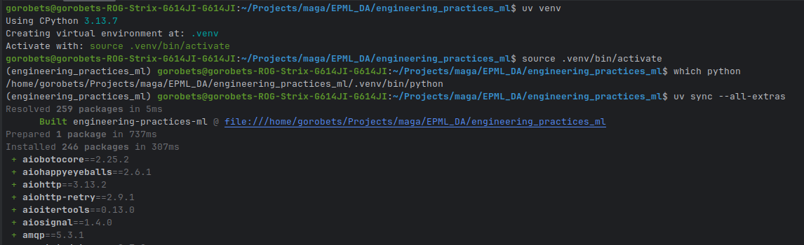
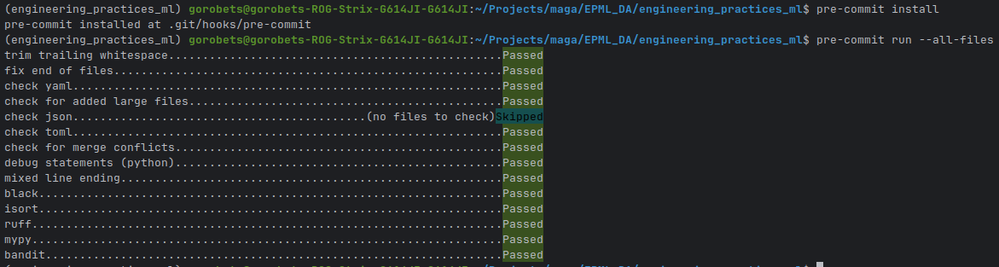
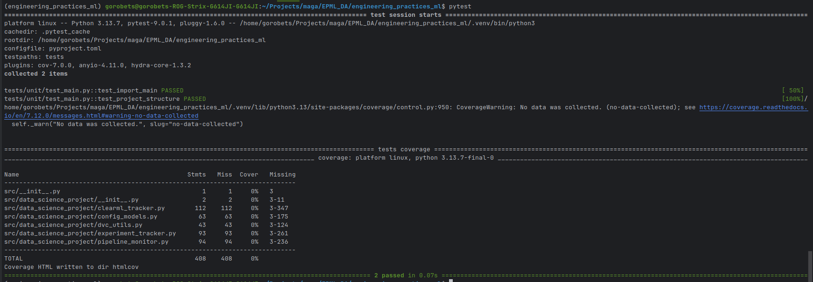

## Быстрый старт: ДЗ 1 — Базовая настройка проекта

Этот `QUICKSTART.md` описывает только то, что нужно для воспроизведения **ДЗ 1** (структура проекта, окружение, качество кода, базовый CI).

### 1. Предварительные условия

- **Установлен Python** 3.10+
- **Установлен Git**
- **Установлен uv** (если нет — см. общий `docs/QUICKSTART.md`, раздел установки инструментов)

### 2. Клонирование репозитория

```bash
git clone https://github.com/M0rtel/engineering_practices_ml.git
cd engineering_practices_ml
```

### 3. Создание и активация виртуального окружения (uv)

```bash
uv venv
source .venv/bin/activate
```

Проверьте, что Python берётся из `.venv`:

```bash
which python
```

### 4. Установка зависимостей проекта

```bash
uv sync --all-extras
```

После этого доступны все инструменты (pytest, mypy, ruff, black, bandit и др.).

Скриншот к пунктам 1-4:


### 5. Проверка качества кода (pre-commit)

#### 5.1. Установка pre-commit хуков

```bash
pre-commit install
```

#### 5.2. Запуск всех проверок локально

```bash
pre-commit run --all-files
```

Ожидаемый результат: все хуки проходят, форматирование и линтинг соответствуют настройкам из `pyproject.toml`.
Скриншот к пункту 5:


### 6. Запуск тестов

```bash
pytest
```

Тесты из `tests/` должны выполняться успешно.
Скриншот к пункту 6:


### 7. Где смотреть результаты по ДЗ 1

- Подробное текстовое описание выполненных пунктов: `docs/homework_1/REPORT.md`
- Скриншоты: `docs/homework_1/screenshots/`
