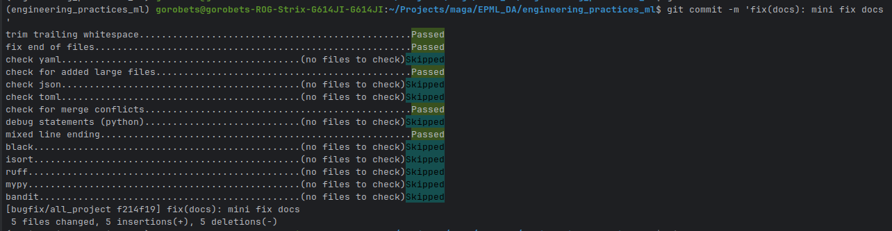
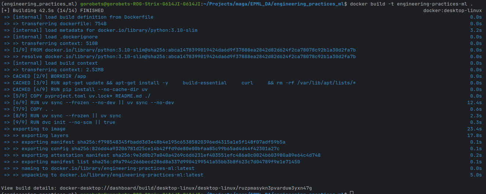
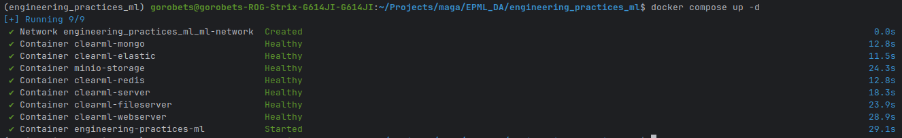
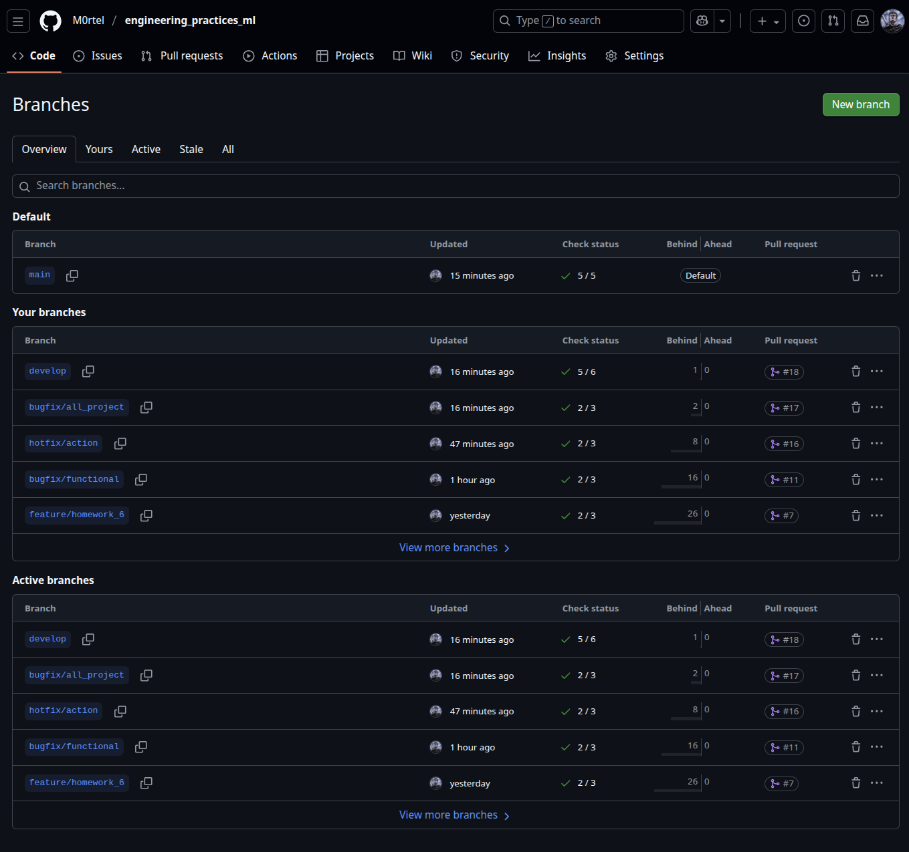
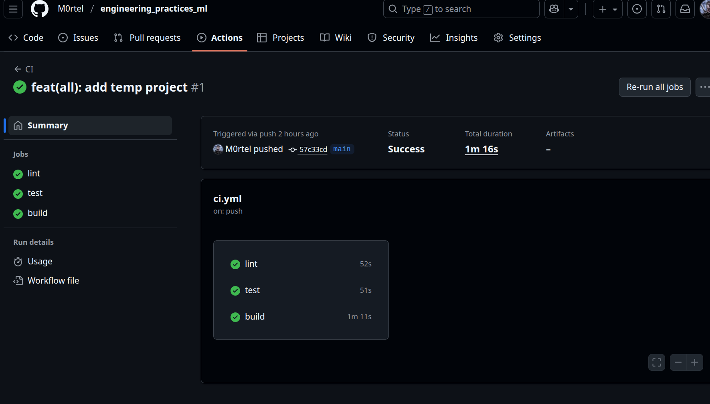
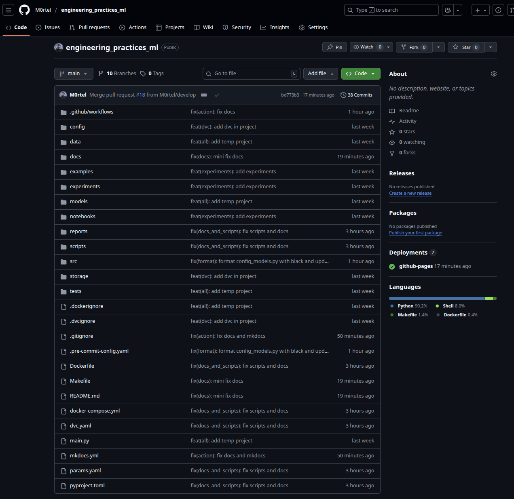

# Отчет о настройке рабочего места Data Scientist

## Введение

Данный отчет описывает процесс настройки полноценного рабочего места для Data Science с использованием современных инженерных практик. Все инструменты настроены и автоматизированы для обеспечения воспроизводимости результатов.

> **Примечание:** Для получения пошаговых инструкций по настройке проекта см. `docs/QUICKSTART.md`. Данный отчет описывает **что было настроено**, а не **как это настроить**.

## 1. Структура проекта (2 балла)

### 1.1. Создание структуры папок

Создана структура проекта с использованием подхода Cookiecutter, следующая лучшим практикам Data Science проектов:

```
engineering_practices_ml/
├── data/                    # Данные проекта
│   ├── raw/                # Исходные данные (WineQT.csv)
│   ├── processed/          # Обработанные данные
│   ├── external/          # Внешние данные
│   └── interim/            # Промежуточные данные
├── src/                    # Исходный код
│   ├── data_science_project/
│   ├── models/             # Модели машинного обучения
│   ├── features/           # Инженерия признаков
│   └── visualization/      # Визуализация
├── tests/                  # Тесты
│   ├── unit/               # Юнит-тесты
│   └── integration/        # Интеграционные тесты
├── notebooks/              # Jupyter notebooks
├── docs/                   # Документация
├── scripts/                # Вспомогательные скрипты
├── config/                 # Конфигурационные файлы
├── reports/                # Отчеты и результаты
│   ├── figures/            # Графики и визуализации
│   └── models/             # Сохраненные модели
└── .github/workflows/      # GitHub Actions (для будущего использования)
```

### 1.2. Шаблоны для новых проектов

Структура проекта создана по образцу Cookiecutter Data Science шаблона и может быть использована как шаблон для новых Data Science проектов. Все необходимые директории созданы с `.gitkeep` файлами для сохранения структуры в Git.

### 1.3. README с описанием проекта

Создан подробный `README.md`, включающий:
- Описание проекта
- Структуру проекта
- Инструкции по установке
- Руководство по использованию
- Описание инструментов качества кода
- Информацию о Git workflow

## 2. Качество кода (2 балла)

### 2.1. Pre-commit hooks

Настроены pre-commit hooks через `.pre-commit-config.yaml`.

**Проверяемые аспекты:**
- Удаление trailing whitespace
- Проверка конца файлов
- Проверка YAML, JSON, TOML файлов
- Проверка больших файлов
- Проверка конфликтов слияния
- Отладка statements

**Инструменты форматирования и линтинга:**
- Black (форматирование кода)
- isort (сортировка импортов)
- Ruff (быстрый линтер и форматтер)
- MyPy (статическая проверка типов)
- Bandit (проверка безопасности)



### 2.2. Форматирование кода

#### Black
- **Конфигурация:** `pyproject.toml`
- **Длина строки:** 88 символов
- **Целевая версия Python:** 3.10
- **Исключения:** `.eggs`, `.git`, `.venv`, `build`, `dist`

#### isort
- **Профиль:** Black (совместимость)
- **Длина строки:** 88 символов
- **Многострочный вывод:** 3
- **Конфигурация:** `pyproject.toml`

#### Ruff
- **Длина строки:** 88 символов
- **Целевая версия:** Python 3.10
- **Правила:** E, W, F, I, B, C4, UP
- **Конфигурация:** `pyproject.toml`

**Примечание:** Подробные инструкции по использованию инструментов форматирования см. в `docs/QUICKSTART.md`.

### 2.3. Линтеры

#### MyPy
- **Версия Python:** 3.10
- **Строгие проверки:** включены
- **Игнорирование импортов:** для sklearn, matplotlib, seaborn, jupyter
- **Конфигурация:** `pyproject.toml`

**Настройки MyPy:**
- `warn_return_any = true`
- `disallow_untyped_defs = true`
- `disallow_incomplete_defs = true`
- `check_untyped_defs = true`
- `no_implicit_optional = true`

#### Bandit
- **Проверка безопасности кода**
- **Исключения:** тесты, виртуальные окружения
- **Пропуски:** B101 (assert_used)

### 2.4. Конфигурационные файлы

Все инструменты настроены через единый файл `pyproject.toml`, что соответствует современным стандартам Python проектов.

## 3. Управление зависимостями (2 балла)

### 3.1. UV для управления зависимостями

Настроен UV как основной инструмент управления зависимостями. UV - это быстрый менеджер пакетов для Python, написанный на Rust.

**Основные зависимости:**
- pandas (2.1.0) - работа с данными
- numpy (1.24.0) - численные вычисления
- scikit-learn (1.3.0) - машинное обучение
- matplotlib (3.7.0) - визуализация
- seaborn (0.12.0) - статистическая визуализация
- jupyter (1.0.0) - интерактивные notebooks
- ipykernel (6.25.0) - ядро для Jupyter

**Зависимости для разработки:**
- black, isort, ruff - форматирование и линтинг
- mypy - проверка типов
- bandit - безопасность
- pre-commit - автоматизация проверок
- pytest, pytest-cov - тестирование

**Примечание:** Пошаговые инструкции по установке UV и зависимостей см. в `docs/QUICKSTART.md` (Шаг 2-3).

### 3.2. Фиксация версий зависимостей

Версии зафиксированы в:
- `pyproject.toml` - для UV (PEP 621 формат)
- `uv.lock` - точные версии (генерируется автоматически)

### 3.3. Виртуальное окружение

UV создает и управляет виртуальным окружением. Виртуальное окружение создается явно через `uv venv` в директории `.venv/`. После активации окружения (`source .venv/bin/activate`) все команды можно выполнять напрямую без префикса `uv run`.

### 3.4. Dockerfile для контейнеризации

Создан `Dockerfile` для контейнеризации проекта.

**Особенности:**
- Базовый образ: Python 3.10-slim
- Установка UV
- Копирование зависимостей и установка
- Настройка PYTHONPATH
- Рабочая директория: /app

**Дополнительно:**
- Создан `.dockerignore` для исключения ненужных файлов
- Создан `docker-compose.yml` для упрощения работы с контейнерами





**Примечание:** Инструкции по сборке и запуску Docker контейнера см. в `docs/QUICKSTART.md`.

## 4. Git workflow (1 балл)

### 4.1. Настройка Git репозитория

Инициализирован Git репозиторий с основной веткой `main` и веткой разработки `develop`.

### 4.2. .gitignore для ML проекта

Создан комплексный `.gitignore`, включающий:

**Python:**
- `__pycache__/`, `*.pyc`, `*.pyo`
- Виртуальные окружения (`.venv`, `venv/`, `env/`)
- Файлы сборки (`build/`, `dist/`, `*.egg-info/`)

**Data Science специфичные:**
- Данные: `data/raw/*`, `data/processed/*`, `data/external/*`, `data/interim/*`
- Модели: `models/*.pkl`, `models/*.h5`, `models/*.joblib`
- Отчеты: `reports/figures/*`, `reports/models/*`
- Notebooks: `*.ipynb_checkpoints`

**Инструменты разработки:**
- Тесты: `.pytest_cache/`, `.coverage`, `htmlcov/`
- Типы: `.mypy_cache/`
- Безопасность: `bandit-report.json`
- IDE: `.vscode/`, `.idea/`

**Сохранение структуры:**
- Использованы `.gitkeep` файлы для пустых директорий

### 4.3. Структура веток

Настроена структура веток по модели Git Flow:

- **main** - основная ветка с рабочим кодом
- **develop** - ветка разработки
- **feature/*** - ветки для новых функций
- **bugfix/*** - ветки для исправления ошибок
- **hotfix/*** - ветки для срочных исправлений

**Документация:** Создан `docs/GIT_WORKFLOW.md` с подробным описанием рабочего процесса.



### 4.4. GitHub Actions CI/CD

Создан `.github/workflows/ci.yml` для автоматизации:

**Стадии:**
1. **lint** - проверка кода (Black, isort, Ruff, MyPy, Bandit)
2. **test** - запуск тестов с покрытием
3. **build** - сборка Docker образа

**Особенности:**
- Автоматическая установка UV
- Генерация отчетов о покрытии кода
- Сборка Docker образа для main и develop веток
- Интеграция с GitHub Actions



## 5. Заключение

Настроено полноценное рабочее место для Data Science с использованием современных инженерных практик:

✅ **Структура проекта** - организована по образцу Cookiecutter
✅ **Качество кода** - автоматизированные проверки через pre-commit
✅ **Управление зависимостями** - UV + pyproject.toml + Docker
✅ **Git workflow** - настроен Git Flow с документацией для GitHub
✅ **Воспроизводимость** - все автоматизировано для легкого воспроизведения

Все инструменты настроены, протестированы и готовы к использованию.


