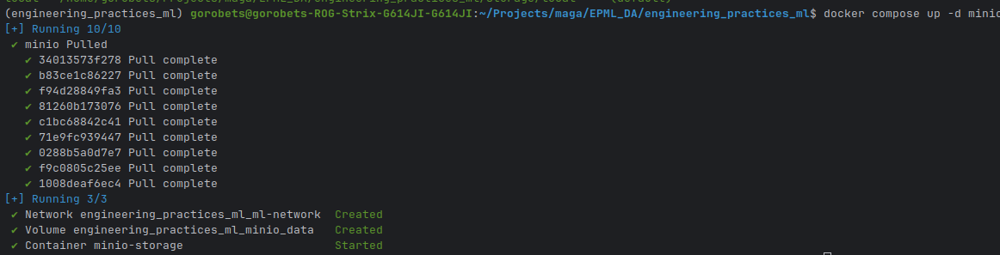
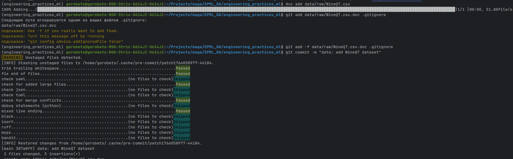
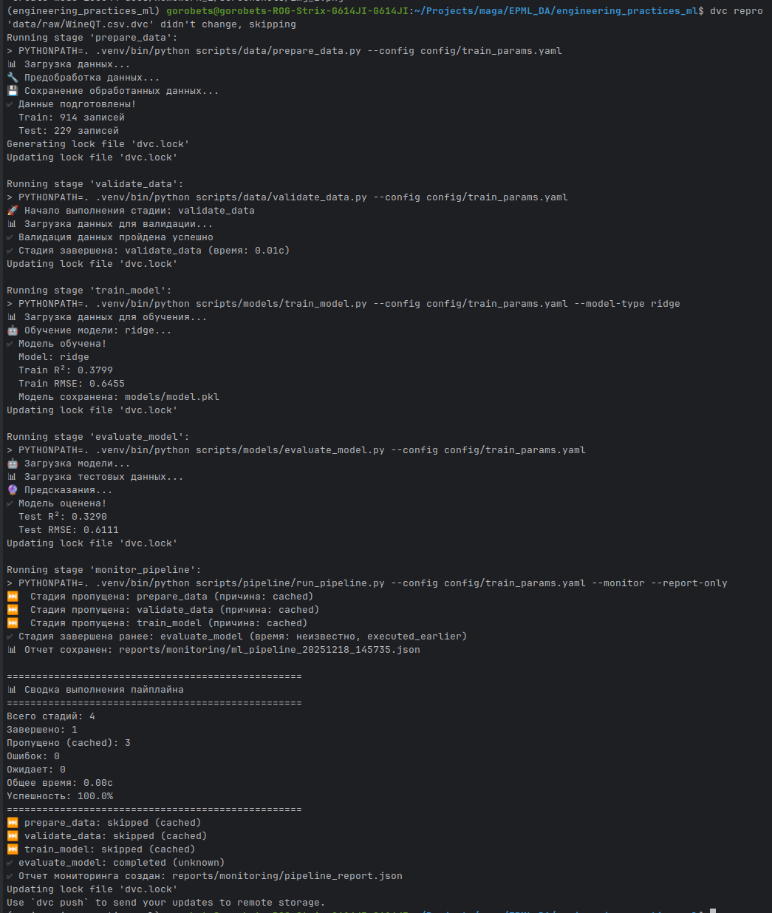
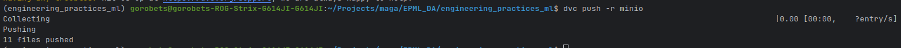
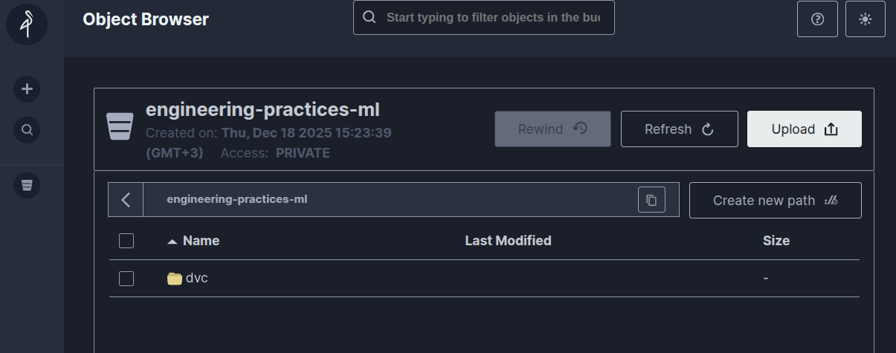

## Быстрый старт: ДЗ 2 — DVC и версионирование данных/моделей

Этот `QUICKSTART.md` описывает только шаги, которые нужны для **воспроизведения ДЗ 2**.
Он основан на **Шаге 6 и Шаге 11** из общего `docs/QUICKSTART.md` и фокусируется на настройке DVC и remote storage именно для этого ДЗ.

Убедитесь, что файл `data/raw/WineQT.csv` присутствует в репозитории (или скачайте его из указанных в задании источников).

### 1. Инициализация и проверка DVC

Если DVC ещё не инициализирован:

```bash
dvc init --no-scm
```


Проверьте конфигурацию:

```bash
dvc version
dvc remote list
cat .dvc/config || echo "Конфиг DVC будет создан автоматически при настройке remote"
```


Подробности см. в `docs/homework_2/REPORT.md`, раздел «Настройка DVC».

### 2. Настройка локального remote (local storage)

```bash
mkdir -p storage/local
dvc remote add -d local storage/local
dvc remote list
```


### 3. Настройка MinIO (через docker-compose)

Запустите инфраструктуру (MinIO и остальные сервисы, если нужно):

```bash
docker compose up -d minio
```



Проверьте, что MinIO доступен по адресу `http://localhost:9000`:

- Логин: `minioadmin`
- Пароль: `minioadmin`

Затем добавьте MinIO как remote:

```bash
dvc remote add minio s3://engineering-practices-ml/dvc
dvc remote modify minio endpointurl http://localhost:9000
```

В активированном окружении задайте креденшели:
   ```bash
   export AWS_ACCESS_KEY_ID=minioadmin
   export AWS_SECRET_ACCESS_KEY=minioadmin
   export AWS_DEFAULT_REGION=us-east-1
   ```

Откройте MinIO UI: `http://localhost:9000`
   Логин/пароль: `minioadmin` / `minioadmin`.

На вкладке Buckets создайте bucket с именем:
   ```text
   engineering-practices-ml
   ```

### 4. Добавление данных в DVC

Добавьте датасет в DVC:

```bash
dvc add data/raw/WineQT.csv
git add -f data/raw/WineQT.csv.dvc
git commit -m "data: add WineQT dataset"
```



### 5. Запуск DVC pipeline

В репозитории уже настроен `dvc.yaml` с этапами:
- `prepare_data`
- `validate_data`
- `train_model`
- `evaluate_model`
- `monitor_pipeline`

Запуск всех стадий:

```bash
dvc repro
```



Проверка графа зависимостей:

```bash
dvc dag
```


### 6. Версионирование артефактов в remote

Отправьте данные и артефакты в настроенный remote:

```bash
dvc push
```




Для разных remote (local / minio / s3) можно использовать:

```bash
dvc push -r local
dvc push -r minio
```

### 7. Где смотреть результаты по ДЗ 2

- Описание настройки DVC и remote storage: `docs/homework_2/REPORT.md`
- Скриншоты: `docs/homework_2/screenshots/`
