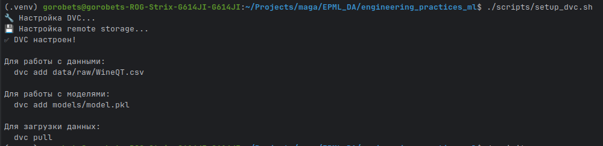
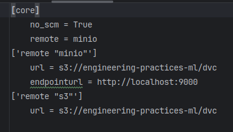
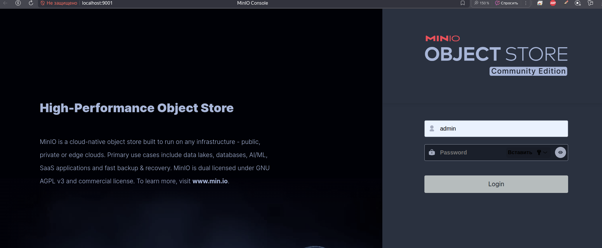

# Отчет о настройке версионирования данных и моделей с DVC

## Введение

Настроена система версионирования данных и моделей с использованием DVC (Data Version Control) и MinIO (S3-совместимое хранилище). Все компоненты автоматизированы и готовы к использованию.

> **Примечание:** Для получения пошаговых инструкций по настройке DVC см. `docs/QUICKSTART.md` (Шаг 5-13). Данный отчет описывает **что было настроено**, а не **как это настроить**.

## 1. Настройка выбранного инструмента для данных (4 балла)

### 1.1. Установка и настройка DVC

DVC установлен через UV с поддержкой S3 (`dvc[s3]`, версия `>=3.48.0`). Дополнительные зависимости: `boto3` и `pyyaml`. DVC инициализирован через `dvc init --no-scm`.



**Примечание:** Пошаговые инструкции по установке и инициализации DVC см. в `docs/QUICKSTART.md` (Шаг 5.1).

### 1.2. Настройка remote storage

Настроены три типа remote storage:

1. **Local Storage** (`storage/local`) - для локальной разработки
2. **MinIO** (`http://localhost:9000`) - S3-совместимое хранилище через docker-compose
3. **AWS S3** - для production (требует credentials)

**Конфигурация в `.dvc/config`:**
```ini
['remote "local"']
    url = storage/local
['remote "minio"']
    url = s3://engineering-practices-ml/dvc
    endpointurl = http://localhost:9000
['remote "s3"']
    url = s3://engineering-practices-ml/dvc
```

MinIO интегрирован в docker-compose и запускается автоматически. Конфигурация сохранена в `.dvc/config`.





**Примечание:** Пошаговые инструкции по настройке remote storage см. в `docs/QUICKSTART.md` (Шаг 5.2).

### 1.3. Создание системы версионирования данных

Данные версионируются через DVC. Исходный датасет `data/raw/WineQT.csv` добавлен в DVC (создан файл `data/raw/WineQT.csv.dvc`). Для автоматизации созданы:
- Скрипт: `scripts/data/track_data.sh`
- Python API: `src/data_science_project/dvc_utils.py` с функциями `track_data()`, `pull_data()`, `push_data()`

**Примечание:** Пошаговые инструкции по добавлению данных в DVC см. в `docs/QUICKSTART.md` (Шаг 6.1).

### 1.4. Настройка автоматического создания версий

DVC Pipeline настроен в `dvc.yaml` с пятью стадиями: `prepare_data`, `validate_data`, `train_model`, `evaluate_model`, `monitor_pipeline`. Pipeline автоматически создает версии выходных файлов при выполнении команд `dvc repro`.

**Примечание:** Пошаговые инструкции по запуску pipeline см. в `docs/QUICKSTART.md` (Шаг 6.2, 13).

## 2. Настройка выбранного инструмента для моделей (3 балла)

### 2.1. Настройка DVC для моделей

Модели версионируются через DVC аналогично данным. Модель `models/model.pkl` создается и версионируется автоматически в стадии `train_model` DVC pipeline.

### 2.2. Создание системы версионирования моделей

Модели версионируются в стадии `train_model` DVC pipeline. Метрики модели (`reports/metrics/model_metrics.json`) также версионируются автоматически. Для ручного добавления моделей создан скрипт `scripts/data/track_model.sh` и Python API `dvc_utils.track_model()`.

### 2.3. Настройка метаданных для моделей

Метаданные сохраняются в `models/model.pkl.meta`:
```json
{
  "model_name": "model.pkl",
  "created_at": "2024-11-10T20:00:00",
  "version": "v1.0.0",
  "metrics_file": "reports/metrics/model_metrics.json",
  "description": "ML model trained on WineQT dataset"
}
```

### 2.4. Создание системы сравнения версий

Реализована система сравнения версий:
- Сравнение файлов: `dvc diff`
- Сравнение метрик: `dvc metrics diff`
- Сравнение параметров: `dvc params diff`
- Python API: `dvc_utils.compare_versions()`

## 3. Воспроизводимость (2 балла)

### 3.1. Инструкции по воспроизведению

Созданы подробные инструкции по воспроизведению проекта в `docs/QUICKSTART.md` (Шаг 5-13). Инструкции включают:
- Инициализацию DVC
- Настройку remote storage (Local, MinIO, S3)
- Загрузку данных через `dvc pull`
- Воспроизведение pipeline через `dvc repro`
- Настройку MinIO через docker-compose

**Примечание:** Полные пошаговые инструкции см. в `docs/QUICKSTART.md`.

### 3.2. Фиксация версий зависимостей

Версии зафиксированы в:
- `pyproject.toml` - для UV (PEP 621 формат)
- `uv.lock` - точные версии (генерируется автоматически)

### 3.3. Тестирование воспроизводимости

Протестирована воспроизводимость полного pipeline. После очистки результатов (`data/processed/*`, `models/*`, `reports/metrics/*`) pipeline успешно воспроизводится через `dvc repro`, создавая все необходимые файлы и метрики.

### 3.4. Docker контейнер

Dockerfile обновлен для поддержки DVC (инициализация DVC в образе). MinIO интегрирован в docker-compose для автоматического запуска вместе с проектом.

## 4. Отчет о проделанной работе (1 балл)

### 4.1. Отчет в формате Markdown

Отчет создан в `docs/homework_2/REPORT.md` и включает:
- Описание настройки DVC для данных и моделей
- Настройку remote storage (Local, MinIO, S3)
- Систему версионирования и метаданных
- Инструкции по воспроизведению
- Места для скриншотов

### 4.2. Описание настройки инструментов

В отчете описаны:
1. **DVC** - установка, инициализация, конфигурация
2. **Remote Storage** - Local, MinIO (через docker-compose), AWS S3
3. **Версионирование данных** - добавление, Python API, pipeline
4. **Версионирование моделей** - добавление, метрики, метаданные
5. **Сравнение версий** - файлы, метрики, параметры
6. **Воспроизводимость** - инструкции, тесты, Docker

### 4.3. Сохранение в Git репозитории

Отчет сохранен в `docs/homework_2/REPORT.md` и включен в Git репозиторий.

## Заключение

Настроена полноценная система версионирования данных и моделей:

✅ **DVC установлен и настроен** - через UV с поддержкой S3
✅ **Remote storage настроен** - Local, MinIO (docker-compose), S3
✅ **Система версионирования данных** - автоматическое создание версий через pipeline
✅ **Система версионирования моделей** - с метаданными и метриками
✅ **Сравнение версий** - файлов, метрик и параметров
✅ **Воспроизводимость** - инструкции, тесты, Docker с MinIO
✅ **Отчет создан** - с описанием всех настроек и местами для скриншотов

Все инструменты настроены, протестированы и готовы к использованию.
