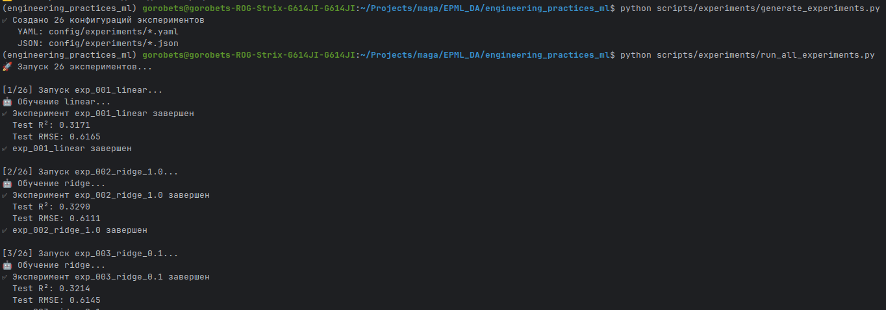

## Быстрый старт: ДЗ 3 — DVC Experiments и трекинг экспериментов

Этот `QUICKSTART.md` описывает, как воспроизвести **систему экспериментов из ДЗ 3**.
Он логически продолжает настройки из `docs/homework_2/QUICKSTART.md` и соответствует разделу **«Шаг 12: Работа с экспериментами»** в общем `docs/QUICKSTART.md`, но без ссылок на удалённые скрипты.

Убедитесь, что DVC уже настроен и данные добавлены (см. `docs/homework_2/QUICKSTART.md`).

### 1. Структура для экспериментов

В проекте уже подготовлены директории:

- `config/experiments/` — конфигурации экспериментов
- `reports/experiments/` — параметры/результаты экспериментов
- `reports/metrics/` — метрики моделей

Проверьте их наличие:

```bash
ls config/experiments || echo "Каталог с конфигами экспериментов может быть пустым"
ls reports/experiments
```

Если каталог `config/experiments/` пустой, то сначала сгенерируй конфиги:

```bash
python scripts/experiments/generate_experiments.py
```

После этого в `config/experiments/` появятся файлы `exp_XXX_*.yaml` и `.json`, и скрипт

```bash
python scripts/experiments/run_all_experiments.py
```

сможет их использовать.




### 2. Сравнение экспериментов

В режиме `no_scm` команды `dvc metrics diff` и `dvc params diff` **недоступны**, поэтому сравнение делается по сохранённым файлам.

1. **Метрики**:

   - после каждого эксперимента смотри файлы в `reports/metrics/`
     (например, `model_metrics.json`, `evaluation.json`);
   - сравнивай значения метрик (`r2`, `rmse`, `mae` и т.п.) между запусками.

2. **Параметры**:

   - фиксируй изменения в `params.yaml` или отдельных конфиг‑файлах (`config/experiments/...`);
   - удобно хранить несколько вариантов параметров (по одному файлу на эксперимент).

Дополнительно можно использовать Python API из модуля `src/data_science_project/experiment_tracker.py` (описан в `docs/homework_3/REPORT.md`) для логирования и сравнения экспериментов.

### 3. Отчёты и визуализация экспериментов

Сводные результаты и скриншоты:

- Отчёт: `docs/homework_3/REPORT.md`
- Скриншоты: `docs/homework_3/screenshots/`

Там показаны:
- примеры запусков большого числа экспериментов,
- сравнение метрик,
- фильтрация и поиск по экспериментам.
