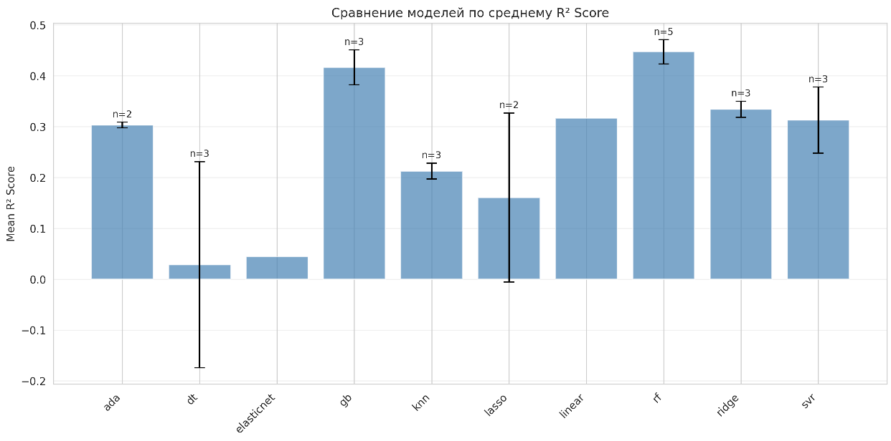
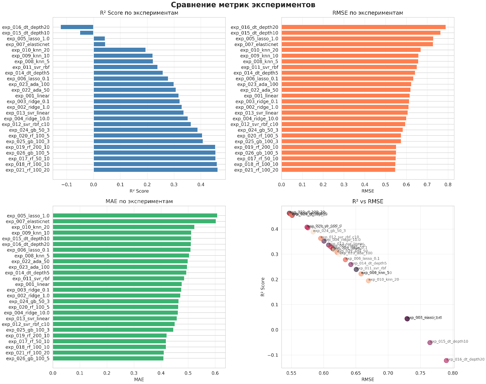

## Быстрый старт: ДЗ 3 — DVC Experiments и трекинг экспериментов

Этот `QUICKSTART.md` описывает, как воспроизвести **систему экспериментов из ДЗ 3**.
Он логически продолжает настройки из `docs/homework_2/QUICKSTART.md` и соответствует разделу **«Шаг 12: Работа с экспериментами»** в общем `docs/QUICKSTART.md`, но без ссылок на удалённые скрипты.

Убедитесь, что DVC уже настроен и данные добавлены (см. `docs/homework_2/QUICKSTART.md`).

### 1. Структура для экспериментов

В проекте уже подготовлены директории:

- `config/experiments/` — конфигурации экспериментов
- `reports/experiments/` — параметры/результаты экспериментов
- `reports/metrics/` — метрики моделей

Проверьте их наличие:

```bash
ls config/experiments || echo "Каталог с конфигами экспериментов может быть пустым"
ls reports/experiments
```

Если каталог `config/experiments/` пустой, то сначала сгенерируй конфиги:

```bash
python scripts/experiments/generate_experiments.py
```

После этого в `config/experiments/` появятся файлы `exp_XXX_*.yaml` и `.json`, и скрипт

```bash
python scripts/experiments/run_all_experiments.py
```

сможет их использовать.


### 2. Сравнение экспериментов

В режиме `no_scm` команды `dvc metrics diff` и `dvc params diff` **недоступны**, поэтому сравнение делается по сохранённым файлам.

1. **Метрики**:

   - после каждого эксперимента смотри файлы в `reports/metrics/`
     (например, `model_metrics.json`, `evaluation.json`);
   - сравнивай значения метрик (`r2`, `rmse`, `mae` и т.п.) между запусками.

2. **Параметры**:

   - фиксируй изменения в `params.yaml` или отдельных конфиг‑файлах (`config/experiments/...`);
   - удобно хранить несколько вариантов параметров (по одному файлу на эксперимент).

Дополнительно можно использовать Python API из модуля `src/data_science_project/experiment_tracker.py` (описан в `docs/homework_3/REPORT.md`) для логирования и сравнения экспериментов.





Подный отчёт: engineering_practices_ml/reports/experiments/latest.md

### 3. Фильтрация и поиск экспериментов

Система фильтрации и поиска реализована в скрипте `scripts/experiments/compare_experiments.py`. Она работает следующим образом:

#### 3.1. Загрузка экспериментов

Все эксперименты загружаются из директорий:
- `reports/experiments/*_params.json` — параметры экспериментов
- `reports/metrics/*_metrics.json` — метрики экспериментов

Функция `load_all_experiments()` автоматически находит все файлы и объединяет параметры с метриками для каждого эксперимента.

#### 3.2. Фильтрация по модели

Фильтрует эксперименты по типу модели (например, `RandomForest`, `LinearRegression`):

```bash
python scripts/experiments/compare_experiments.py --filter-model RandomForest
```

**Как работает:**
- Функция `filter_experiments()` проверяет поле `model_name` в каждом эксперименте
- Возвращает только эксперименты с указанным типом модели

#### 3.3. Фильтрация по метрикам

Фильтрует эксперименты по значениям метрик:

```bash
# Минимальный R² (коэффициент детерминации)
python scripts/experiments/compare_experiments.py --min-r2 0.8

# Максимальный RMSE (среднеквадратичная ошибка)
python scripts/experiments/compare_experiments.py --max-rmse 0.5

# Комбинация фильтров
python scripts/experiments/compare_experiments.py --min-r2 0.7 --max-rmse 0.6
```

**Как работает:**
- Функция `filter_experiments()` проверяет метрики в `exp["metrics"]`
- `--min-r2`: оставляет только эксперименты с `test_r2 >= указанное_значение`
- `--max-rmse`: оставляет только эксперименты с `test_rmse <= указанное_значение`
- Фильтры можно комбинировать (логическое И)

#### 3.4. Поиск по запросу

Ищет эксперименты по ID или названию модели:

```bash
python scripts/experiments/compare_experiments.py --search forest
```

**Как работает:**
- Функция `search_experiments()` выполняет поиск без учёта регистра
- Ищет вхождение запроса в:
  - `experiment_id` (например, `exp_001_forest`)
  - `model_name` (например, `RandomForest`)
- Возвращает все эксперименты, где запрос найден хотя бы в одном из полей

#### 3.5. Список всех экспериментов

Показывает все доступные эксперименты с их метриками:

```bash
python scripts/experiments/compare_experiments.py --list
```

**Вывод:**
```
📋 Всего экспериментов: 26

  exp_001_linear: LinearRegression - R²=0.8234, RMSE=0.6543
  exp_002_ridge: Ridge - R²=0.8456, RMSE=0.6123
  ...
```

#### 3.6. Экспорт в CSV

Экспортирует все эксперименты в CSV файл для анализа:

```bash
python scripts/experiments/compare_experiments.py --export experiments.csv
```

**Как работает:**
- Функция `export_to_dataframe()` создаёт pandas DataFrame
- Каждая строка — один эксперимент
- Колонки включают:
  - `experiment_id`, `model_name`
  - Параметры (с префиксом `param_`)
  - Метрики (названия метрик как есть)

#### 3.7. Сравнение двух экспериментов

Сравнивает параметры и метрики двух экспериментов:

```bash
python scripts/experiments/compare_experiments.py --compare exp_001_linear exp_006_lasso_0.1
```

**Вывод:**
```
📊 Сравнение экспериментов:
  exp_001_linear vs exp_002_ridge

Параметры:
  Модель: LinearRegression vs Ridge
  alpha: N/A → 0.1

Метрики:
  test_r2: 0.8234 → 0.8456 (+0.0222)
  test_rmse: 0.6543 → 0.6123 (-0.0420)
```

### 4. Отчёты и визуализация экспериментов

Сводные результаты и скриншоты:

- Отчёт: `docs/homework_3/REPORT.md`
- Скриншоты: `docs/homework_3/screenshots/`

Там показаны:
- примеры запусков большого числа экспериментов,
- сравнение метрик,
- фильтрация и поиск по экспериментам.
