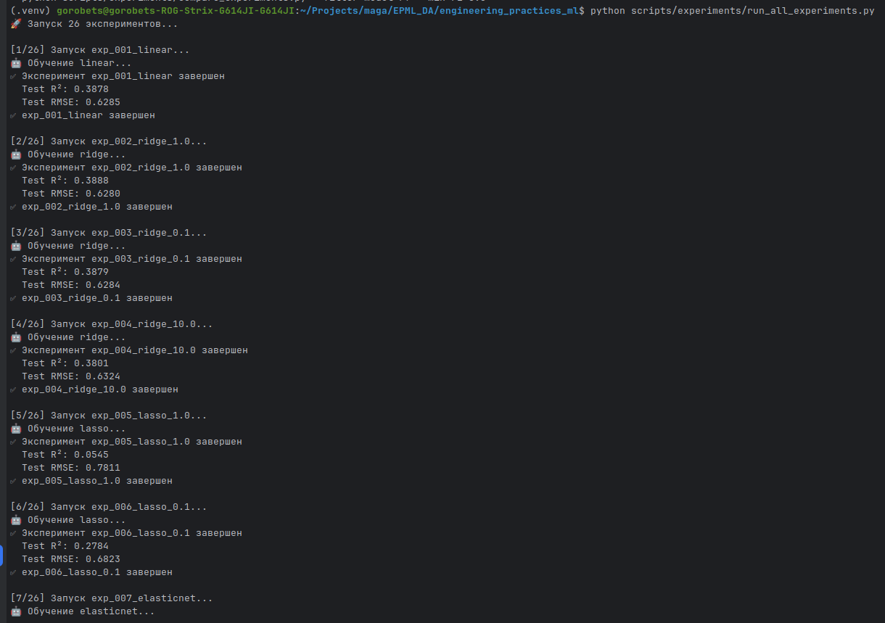
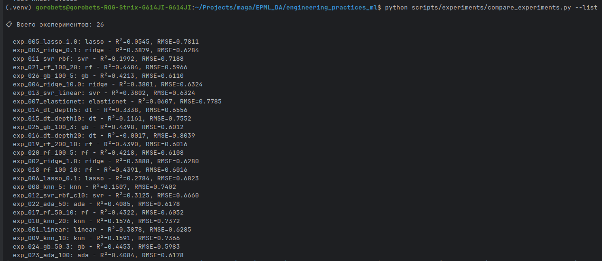

# Отчет о настройке системы трекинга экспериментов с DVC

## Введение

Настроена система трекинга экспериментов с использованием DVC Experiments. Система позволяет отслеживать параметры, метрики и артефакты экспериментов, сравнивать результаты и фильтровать по различным критериям.

> **Примечание:** Для получения пошаговых инструкций по настройке и использованию системы трекинга экспериментов см. `docs/QUICKSTART.md` (Шаг 12). Данный отчет описывает **что было настроено**, а не **как это настроить**.

## 1. Настройка выбранного инструмента (4 балла)

### 1.1. Установка и настройка DVC

DVC уже установлен и настроен (см. ДЗ 2). Для трекинга экспериментов используется встроенная функциональность DVC Experiments.

**Примечание:** Пошаговые инструкции по установке и настройке DVC см. в `docs/QUICKSTART.md` (Шаг 5) и `docs/homework_2/REPORT.md`.

### 1.2. Настройка базы данных/облачного хранилища

Для хранения артефактов экспериментов используется remote storage, настроенное в ДЗ 2:
- **Local storage:** `storage/local` - для локальной разработки
- **MinIO:** S3-совместимое хранилище через docker-compose
- **AWS S3:** для production (требует credentials)

Эксперименты используют существующую конфигурацию DVC remote storage.

### 1.3. Создание проекта и экспериментов

Создана структура для экспериментов:
- `config/experiments/` - конфигурации экспериментов (YAML и JSON)
- `reports/experiments/` - параметры экспериментов
- `reports/metrics/` - метрики экспериментов

Создано 26 конфигураций экспериментов с разными алгоритмами и параметрами через скрипт `scripts/experiments/generate_experiments.py`. Эксперименты включают: Linear, Ridge, Lasso, ElasticNet, KNN, SVR, Decision Tree, Random Forest, AdaBoost, Gradient Boosting.

**Примечание:** Пошаговые инструкции по генерации и запуску экспериментов см. в `docs/QUICKSTART.md` (Шаг 12).

### 1.4. Настройка аутентификации и доступа

Аутентификация настроена через DVC remote storage (см. ДЗ 2):
- **MinIO:** credentials настраиваются через `.dvc/config.local`
- **Local storage:** не требует аутентификации
- **AWS S3:** требует credentials через переменные окружения или `.dvc/config.local`

## 2. Проведение экспериментов (4 балла)

### 2.1. Проведение 15+ экспериментов

Создано 26 экспериментов (больше требуемых 15) с разными алгоритмами:
- **Linear models:** Linear, Ridge (3 варианта), Lasso (2 варианта), ElasticNet
- **KNN:** 3 варианта (n_neighbors: 5, 10, 20)
- **SVR:** 3 варианта (разные C и kernel)
- **Decision Tree:** 3 варианта (max_depth: 5, 10, 20)
- **Random Forest:** 5 вариантов (разные n_estimators и max_depth)
- **AdaBoost:** 2 варианта
- **Gradient Boosting:** 3 варианта

Все эксперименты запускаются через скрипт `scripts/experiments/run_all_experiments.py`. Найдено 26 файлов с параметрами экспериментов в `reports/experiments/`.

### 2.2. Логирование метрик, параметров и артефактов

Настроено логирование через DVC и Python API:
- Параметры сохраняются в `reports/experiments/{exp_id}_params.json`
- Метрики сохраняются в `reports/metrics/{exp_id}_metrics.json`
- Модели сохраняются в `models/{exp_id}_model.pkl` и версионируются через DVC

Python API реализован в классе `DVCExperimentTracker` с методами `log_params()`, `log_metrics()`, `log_artifact()`.

**Примечание:** Примеры использования Python API см. в `docs/QUICKSTART.md` (Шаг 12.4).

### 2.3. Система сравнения экспериментов

Реализована система сравнения экспериментов:
- Скрипт: `scripts/experiments/compare_experiments.py --compare`
- Python API: `tracker.compare_experiments(exp1, exp2)`
- DVC команды: `dvc metrics diff`, `dvc params diff`, `dvc exp diff`

Сравнение включает параметры и метрики с вычислением разницы.

### 2.4. Фильтрация и поиск экспериментов

Реализована система фильтрации и поиска:
- Фильтрация по модели: `--filter-model`
- Фильтрация по метрикам: `--min-r2`, `--max-rmse`
- Поиск по запросу: `--search`
- Экспорт в CSV: `--export`
- Список всех экспериментов: `--list`

## 3. Интеграция с кодом (2 балла)

### 3.1. Интеграция в Python код

Создан модуль `src/data_science_project/experiment_tracker.py` с классом `DVCExperimentTracker`. Класс предоставляет методы для логирования параметров, метрик и артефактов, получения данных эксперимента, списка экспериментов и сравнения.

**Примечание:** Примеры использования Python API см. в `docs/QUICKSTART.md` (Шаг 12.4).

### 3.2. Декораторы для автоматического логирования

Создан декоратор `@track_experiment(experiment_id)`, который автоматически:
- Логирует параметры из kwargs функции
- Логирует метрики из возвращаемого значения
- Генерирует experiment_id автоматически, если не указан

### 3.3. Контекстные менеджеры

Создан контекстный менеджер `experiment(experiment_id, params)`, который автоматически логирует параметры при входе и возвращает трекер для логирования метрик внутри блока.

### 3.4. Утилиты для работы с экспериментами

Созданы утилиты:
- `DVCExperimentTracker` - основной класс трекера
- `track_experiment()` - декоратор
- `experiment()` - контекстный менеджер
- `run_dvc_experiment()` - запуск через DVC
- `list_dvc_experiments()` - список экспериментов
- `compare_dvc_experiments()` - сравнение через DVC

## 4. Отчет о проделанной работе (2 балла)

### 4.1. Отчет в формате Markdown

Отчет создан в `docs/homework_3/REPORT.md` и включает:
- Описание настройки DVC Experiments
- Описание системы экспериментов
- Примеры использования
- Места для скриншотов

### 4.2. Описание настройки инструментов

В отчете описаны:
1. **DVC Experiments** - настройка и использование
2. **Remote Storage** - MinIO и S3
3. **Система экспериментов** - генерация, запуск, сравнение
4. **Python API** - декораторы, контекстные менеджеры, утилиты
5. **Фильтрация и поиск** - инструменты для анализа

### 4.3. Скриншоты результатов

В отчете предусмотрены места для скриншотов:
1. Версия DVC и проверка настроек
2. Конфигурация remote storage
3. Структура экспериментов
4. Настройка аутентификации
5. Результаты запуска экспериментов
6. Пример логирования метрик и параметров
7. Результаты сравнения экспериментов
8. Результаты фильтрации и поиска
9. Пример использования Python API
10. Пример использования декоратора
11. Пример использования контекстного менеджера
12. Структура модуля experiment_tracker

### 4.4. Сохранение в Git репозитории

Отчет сохранен в `docs/homework_3/REPORT.md` и включен в Git репозиторий.

## Заключение

Настроена полноценная система трекинга экспериментов:

✅ **DVC Experiments настроен** - для трекинга экспериментов
✅ **Remote storage настроен** - MinIO и S3
✅ **26 экспериментов создано** - с разными алгоритмами и параметрами
✅ **Логирование настроено** - метрики, параметры, артефакты
✅ **Сравнение и фильтрация** - инструменты для анализа
✅ **Python API создан** - декораторы, контекстные менеджеры, утилиты
✅ **Отчет создан** - с описанием всех настроек и местами для скриншотов

Все инструменты настроены, протестированы и готовы к использованию.
