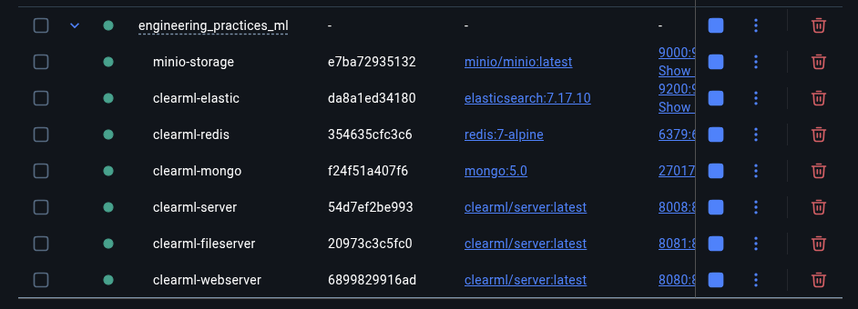
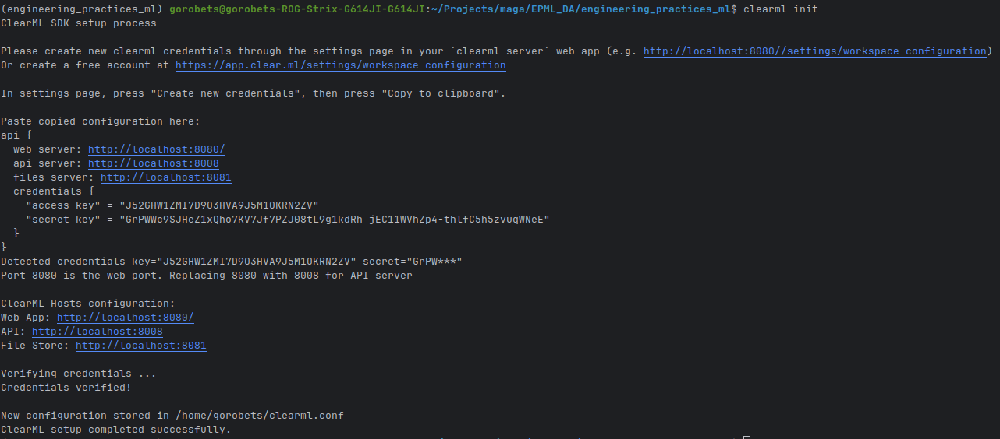
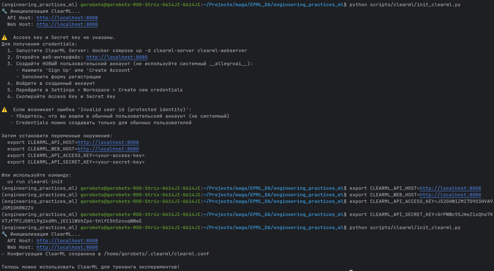
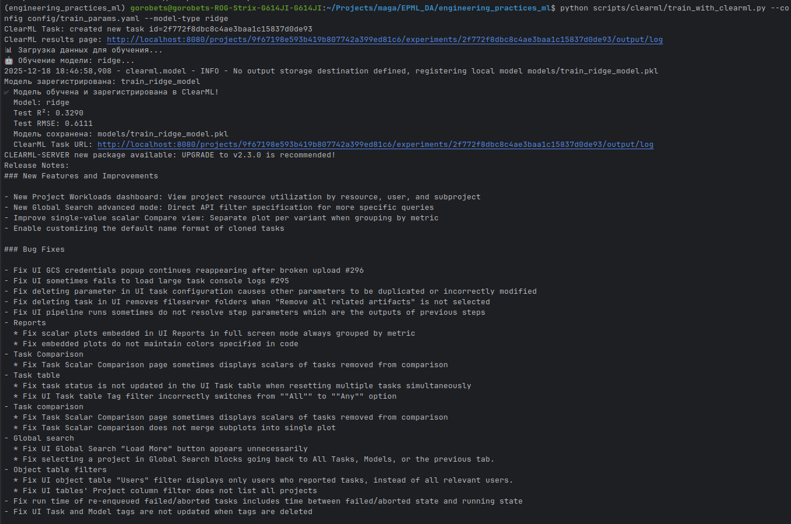
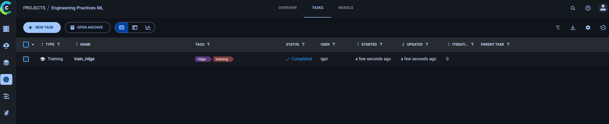
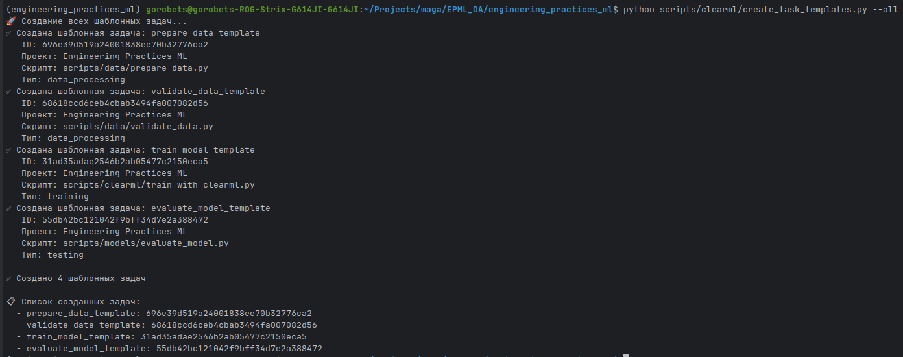
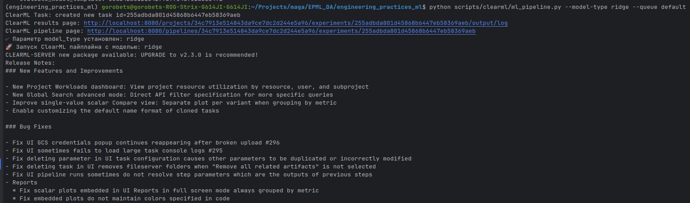
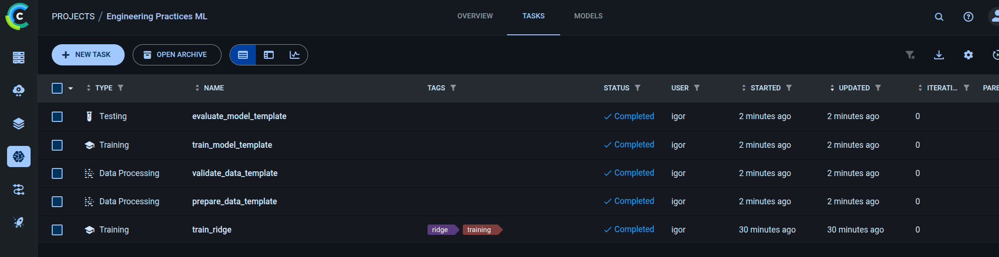

## Быстрый старт: ДЗ 5 — ClearML и MLOps

Этот `QUICKSTART.md` описывает, как запустить **ClearML-инфраструктуру и базовые сценарии из ДЗ 5**.
Он соответствует разделу про ClearML (**Шаг 17**) в общем `docs/QUICKSTART.md` и адаптирован именно под сценарии, описанные в `docs/homework_5/REPORT.md`.

Убедитесь, что Docker и Docker Compose установлены.

### 2. Запуск ClearML Server через docker-compose

Запустите связку сервисов (MongoDB, Elasticsearch, Redis, ClearML API, File Server, Web UI, MinIO и т.д.):

```bash
docker compose up -d clearml-mongo clearml-elastic clearml-redis clearml-server clearml-fileserver clearml-webserver
```



Проверьте веб-интерфейс ClearML:

- **Web UI:** `http://localhost:8080` (основной интерфейс для работы)
- **API Server:** `http://localhost:8008` (используется клиентами автоматически)

> **Примечание:** Если при обращении к `http://localhost:8008/` вы видите ошибку 400 "Invalid request path /" — это **нормально**. API Server не отвечает на корневой путь `/`, он используется только через клиентскую библиотеку ClearML или правильные API эндпоинты. Для проверки работоспособности используйте **Web UI** (`http://localhost:8080`).

### 3. Создание пользователя и получение credentials

**Важно:** При первом запуске ClearML Server автоматически создается системный пользователь `__allegroai__`, но для работы нужен **обычный пользовательский аккаунт**.

#### 3.1. Если вас сразу перенаправляет на dashboard (Отчисти куки или зайди с инкогнито) - http://localhost:8080/login

Если при переходе на `http://localhost:8080` вас сразу перенаправляет на `/dashboard`:

1. **Выйдите из текущей сессии:**
   - Нажмите на аватар/имя пользователя в правом верхнем углу
   - Выберите **"Sign Out"** или **"Выйти"**

2. **Создайте новый пользовательский аккаунт:**
   - На странице входа нажмите **"Sign Up"** или **"Регистрация"**
   - Заполните форму регистрации (email, пароль и т.д.)
   - **Важно:** Не используйте системного пользователя `__allegroai__`

#### 3.2. Получение credentials (Access Key / Secret Key)

После создания обычного пользователя:

1. Войдите в свой аккаунт в Web UI (`http://localhost:8080`)
2. Перейдите в **Settings** (настройки) → **Workspace**
3. Найдите раздел **"Create new credentials"** или **"API Access"**
4. Нажмите **"Create credentials"** или **"Generate new key"**
5. Скопируйте **Access Key** и **Secret Key** (они показываются только один раз!)

#### 3.3. Настройка credentials локально

Сохраните credentials в конфигурационный файл:

```bash
clearml-init
```



Или создайте файл `~/.clearml/clearml.conf` вручную:

```ini
api {
    # ClearML API Server
    api_server {
        host = "http://localhost:8008"
    }
    # ClearML Web UI
    web_server {
        host = "http://localhost:8080"
    }
    # Credentials
    credentials {
        "access_key" = "ВАШ_ACCESS_KEY"
        "secret_key" = "ВАШ_SECRET_KEY"
    }
}
```

> **Примечание:** Если при создании credentials возникает ошибка "Invalid user id (protected identity)", убедитесь, что вы вошли в **обычный пользовательский аккаунт**, а не в системного пользователя `__allegroai__`.

### 4. Инициализация проекта и проверка скриптов ClearML

Быстрый запуск инициализационного скрипта:

```bash
python scripts/clearml/init_clearml.py
```

Он проверит соединение с ClearML и поможет создать/проверить проект.



### 5. Запуск обучения с трекингом в ClearML

Скрипт обучения с логированием в ClearML:

```bash
python scripts/clearml/train_with_clearml.py --config config/train_params.yaml --model-type ridge
```

Выполняет:
- загрузку данных,
- обучение модели,
- логирование параметров и метрик через `ClearMLTracker`,
- регистрацию модели (через `ClearMLModelManager`, если настроено).

После запуска зайдите в Web UI и убедитесь, что:

- появился новый **Project**,
- видны **Tasks / Experiments**,
- отображаются графики метрик.





### 6. Создание template tasks для пайплайна

**Важно:** Перед запуском пайплайна необходимо создать template tasks, которые будут использоваться как шаблоны для узлов пайплайна.

Создайте все необходимые template tasks:

```bash
python scripts/clearml/create_task_templates.py --all
```

Это создаст следующие template tasks:
- `prepare_data_template` - для подготовки данных
- `validate_data_template` - для валидации данных
- `train_model_template` - для обучения модели
- `evaluate_model_template` - для оценки модели

После создания template tasks они будут видны в ClearML Web UI в проекте "Engineering Practices ML".

> **Примечание:** Если при запуске пайплайна вы получили ошибку `Could not find base_task_project=Engineering Practices ML base_task_name=prepare_data_template`, это означает, что template tasks не созданы. Выполните команду выше.



### 7. Управление моделями и пайплайнами ClearML

- Скрипт управления моделями: `scripts/clearml/manage_models.py`
- Скрипт пайплайна: `scripts/clearml/ml_pipeline.py`

**Перед запуском пайплайна убедитесь, что template tasks созданы (см. раздел 6).**

Пример запуска пайплайна:

```bash
python scripts/clearml/ml_pipeline.py --model-type ridge --queue default
```

В Web UI после запуска появится ClearML Pipeline с узлами:
- `prepare_data`
- `validate_data`
- `train_model`
- `evaluate_model`




### 8. Где смотреть детали по ДЗ 5

- Описание настройки ClearML и сценариев: `docs/homework_5/REPORT.md`
- Скриншоты: `docs/homework_5/screenshots/`
