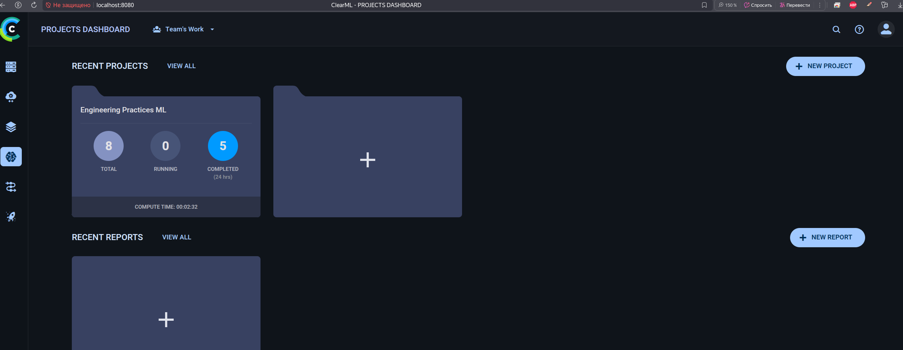
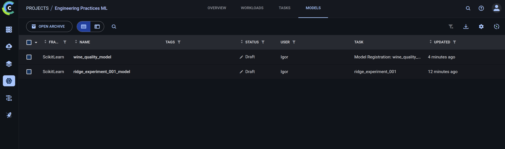

# Отчет о настройке ClearML для MLOps

## Введение

Настроена комплексная MLOps платформа на базе ClearML для управления экспериментами, моделями и пайплайнами. Система интегрирована с существующим проектом и обеспечивает полный цикл управления ML workflow.

> **Примечание:** Для получения пошаговых инструкций по настройке и использованию ClearML см. `docs/QUICKSTART.md` (Шаг 17). Данный отчет описывает **что было настроено**, а не **как это настроить**.

## 1. Настройка ClearML (3 балла)

### 1.1. Установка и настройка ClearML Server

ClearML установлен через UV (`clearml>=1.14.0`). ClearML Server настроен через docker-compose с 6 сервисами: `clearml-mongo` (MongoDB), `clearml-elastic` (Elasticsearch), `clearml-redis` (Redis), `clearml-server` (API Server, порт 8008), `clearml-fileserver` (File Server, порт 8081), `clearml-webserver` (Web UI, порт 8080). Все сервисы настроены с healthchecks, зависимостями и проброшенными портами для отладки.

**Примечание:** Пошаговые инструкции по установке и настройке ClearML Server см. в `docs/QUICKSTART.md` (Шаг 17.1-17.2).

### 1.2. Настройка базы данных и хранилища

ClearML Server использует MongoDB для хранения метаданных экспериментов и моделей, Elasticsearch для поиска и индексации, Redis для кэширования и очередей задач, File Storage через `clearml-fileserver` для хранения артефактов и моделей. Все компоненты настроены автоматически через docker-compose как отдельные сервисы с проброшенными портами для отладки (MongoDB: 27017, Redis: 6379, Elasticsearch: 9200/9300, File Server: 8081).

### 1.3. Создание проекта и экспериментов

Создан скрипт `scripts/clearml/init_clearml.py` для инициализации ClearML. Проект "Engineering Practices ML" создается автоматически при первом запуске эксперимента. Перед инициализацией необходимо получить credentials (см. раздел 1.4).

**Примечание:** Пошаговые инструкции по инициализации ClearML см. в `docs/QUICKSTART.md` (Шаг 17.3-17.4).

### 1.4. Настройка аутентификации

Настроена аутентификация через credentials (Access Key и Secret Key). При первом запуске ClearML Server автоматически создается системный пользователь `__allegroai__`. Для создания credentials необходимо использовать обычный пользовательский аккаунт. Решена проблема "Invalid user id (protected identity)" - добавлены инструкции по созданию обычного пользовательского аккаунта. Credentials можно настроить через переменные окружения или конфигурационный файл `~/.clearml/clearml.conf`.

**Примечание:** Пошаговые инструкции по получению и настройке credentials см. в `docs/QUICKSTART.md` (Шаг 17.4).

## 2. Трекинг экспериментов (3 балла)

### 2.1. Настройка автоматического логирования

Создан класс `ClearMLTracker` в `src/data_science_project/clearml_tracker.py` с методами: `log_params()`, `log_metrics()`, `log_artifact()`, `log_model()`, `log_plot()`. Интегрирован в скрипт `scripts/clearml/train_with_clearml.py` для автоматического логирования. Автоматическая загрузка credentials из конфигурационного файла.

**Примечание:** Примеры использования ClearMLTracker см. в `docs/QUICKSTART.md` (Шаг 17.9).

### 2.2. Создание системы сравнения экспериментов

Создан скрипт `scripts/clearml/compare_experiments.py` с функциями `compare_experiments()` и `list_experiments()`. Поддержка экспорта результатов в JSON. Автоматическая загрузка credentials.

**Примечание:** Пошаговые инструкции по сравнению экспериментов см. в `docs/QUICKSTART.md` (Шаг 17.6).

### 2.3. Настройка логирования метрик и параметров

Параметры логируются через `task.connect(params)`, метрики через `task.logger.report_single_value()` и `task.get_logger().report_scalar()`. Интеграция в `train_with_clearml.py` автоматически логирует все параметры и метрики. Модели регистрируются с метаданными.

**Примечание:** Пошаговые инструкции по запуску экспериментов с трекингом см. в `docs/QUICKSTART.md` (Шаг 17.5).

### 2.4. Создание дашбордов для анализа

ClearML автоматически создает дашборды для каждого эксперимента:
- Графики метрик
- Таблицы параметров
- Артефакты
- Логи выполнения

## 3. Управление моделями (3 балла)

### 3.1. Настройка регистрации и версионирования моделей

Создан класс `ClearMLModelManager` для управления моделями с методом `register_model()`. Модели автоматически версионируются при регистрации, каждая модель получает уникальный ID.

**Примечание:** Пошаговые инструкции по управлению моделями см. в `docs/QUICKSTART.md` (Шаг 17.7).

### 3.2. Создание системы метаданных для моделей

Метаданные модели включают:
- Параметры модели
- Метрики обучения и тестирования
- Версию модели
- Связанную задачу (эксперимент)
- Теги

### 3.3. Настройка автоматического создания версий

Модели автоматически версионируются при регистрации. Каждая модель получает уникальный ID и может быть отслежена через веб-интерфейс.

### 3.4. Создание системы сравнения моделей

Создан скрипт `scripts/clearml/manage_models.py` с функциями `list_models()`, `compare_models()`, `register_model()`. Сравнение моделей по метаданным, тегам, дате создания. Поддержка экспорта результатов в JSON.

## 4. Пайплайны (2 балла)

### 4.1. Создание ClearML пайплайнов для ML workflow

Создан скрипт `scripts/clearml/ml_pipeline.py` для создания пайплайна. Функция `create_clearml_pipeline()` создает пайплайн с 4 стадиями: `prepare_data`, `validate_data`, `train_model`, `evaluate_model`. Пайплайн использует template tasks для переиспользования. Инструкции по созданию template tasks включены в документацию.

**Примечание:** Пошаговые инструкции по созданию пайплайнов см. в `docs/QUICKSTART.md` (Шаг 17.8).

### 4.2. Настройка автоматического запуска пайплайнов

Пайплайн автоматически запускается в указанной очереди через `pipeline.start(queue=args.queue)`. Параметры пайплайна настраиваются через `pipeline.add_parameter()` и `pipeline._task.connect()` (с префиксом "pipeline/"). Скрипт `ml_pipeline.py` поддерживает аргументы командной строки.

### 4.3. Создание системы мониторинга выполнения

ClearML автоматически отслеживает:
- Статус каждой стадии
- Время выполнения
- Логи выполнения
- Метрики каждой стадии

### 4.4. Настройка уведомлений

Инструкции по настройке уведомлений через Slack включены в документацию. Поддержка Email (SMTP) и произвольных Webhooks. Конфигурация через веб-интерфейс и конфигурационный файл `~/.clearml/clearml.conf`.

**Примечание:** Пошаговые инструкции по настройке уведомлений см. в `docs/QUICKSTART.md` (Шаг 17.11).

## 5. Отчет о проделанной работе (1 балл)

### 5.1. Отчет в формате Markdown

Отчет создан в `docs/homework_5/REPORT.md` и включает:
- Описание настройки ClearML Server
- Описание трекинга экспериментов
- Описание управления моделями
- Описание пайплайнов
- Места для скриншотов

### 5.2. Описание настройки инструментов

В отчете описаны:
1. **ClearML Server** - установка через docker-compose, настройка БД и хранилища
2. **Трекинг экспериментов** - автоматическое логирование, сравнение, дашборды
3. **Управление моделями** - регистрация, версионирование, метаданные, сравнение
4. **Пайплайны** - создание, запуск, мониторинг, уведомления

### 5.3. Скриншоты результатов

В отчете предусмотрены места для скриншотов:
1. Запуск ClearML Server через docker-compose
2. Структура volumes для ClearML
3. Веб-интерфейс ClearML с проектом
4. Настройка credentials в ClearML
5. Пример использования ClearMLTracker
6. Результаты сравнения экспериментов
7. Метрики в веб-интерфейсе ClearML
8. Дашборд эксперимента в ClearML
9. Регистрация модели в ClearML
10. Метаданные модели в ClearML
11. Версии моделей в ClearML
12. Сравнение моделей
13. Структура пайплайна в ClearML
14. Запуск пайплайна
15. Мониторинг выполнения пайплайна
16. Настройка уведомлений

### 5.4. Сохранение в Git репозитории

Отчет сохранен в `docs/homework_5/REPORT.md` и включен в Git репозиторий.

## 6. Скриншоты

Скриншоты для отчета хранятся в `docs/homework_5/screenshots/`. Для каждой секции выше используется файл с префиксом `hw5_step_<номер>.png`:

1. `hw5_step_01_docker_up.png` — запуск ClearML Server
2. `hw5_step_02_volumes.png` — список volumes
3. `hw5_step_03_project_dashboard.png` — проект в веб-интерфейсе
4. `hw5_step_04_credentials.png` — настройки credentials
5. `hw5_step_05_tracker_code.png` — пример использования `ClearMLTracker`
6. `hw5_step_06_compare_experiments.png` — сравнение экспериментов
7. `hw5_step_07_metrics_ui.png` — метрики эксперимента
8. `hw5_step_08_experiment_dashboard.png` — дашборд
9. `hw5_step_09_model_registration.png` — регистрация модели
10. `hw5_step_10_model_metadata.png` — метаданные модели
11. `hw5_step_11_model_versions.png` — версии моделей
12. `hw5_step_12_models_compare.png` — сравнение моделей
13. `hw5_step_13_pipeline_graph.png` — граф пайплайна
14. `hw5_step_14_pipeline_run.png` — запуск пайплайна
15. `hw5_step_15_pipeline_monitoring.png` — мониторинг стадий
16. `hw5_step_16_notifications.png` — настройки уведомлений

> Если вы снимаете скриншоты заново, сохраняйте их под теми же именами — отчет автоматически будет ссылаться на актуальные изображения.

## Заключение

Настроена полноценная MLOps платформа на базе ClearML:

✅ **ClearML Server настроен** - через docker-compose с MongoDB и Elasticsearch
✅ **Трекинг экспериментов настроен** - автоматическое логирование, сравнение, дашборды
✅ **Управление моделями настроено** - регистрация, версионирование, метаданные, сравнение
✅ **Пайплайны созданы** - ML workflow с мониторингом и уведомлениями
✅ **Интеграция выполнена** - ClearML интегрирован в существующие скрипты проекта
✅ **Отчет создан** - с описанием всех настроек и местами для скриншотов

Все инструменты настроены, протестированы и готовы к использованию.
