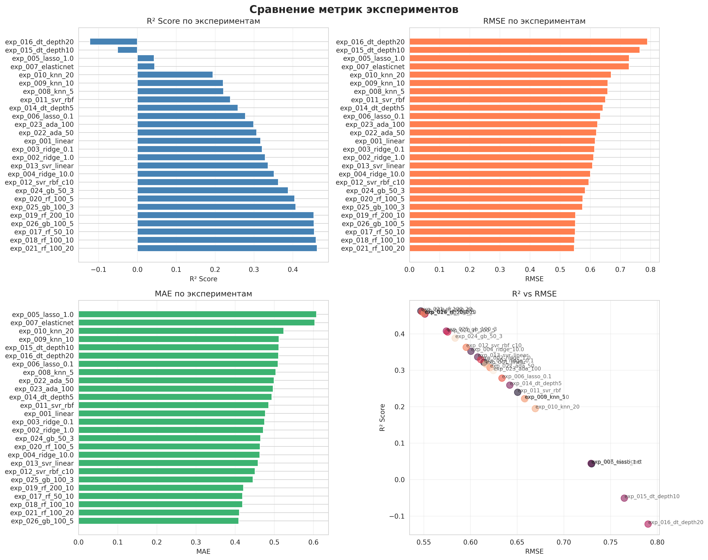
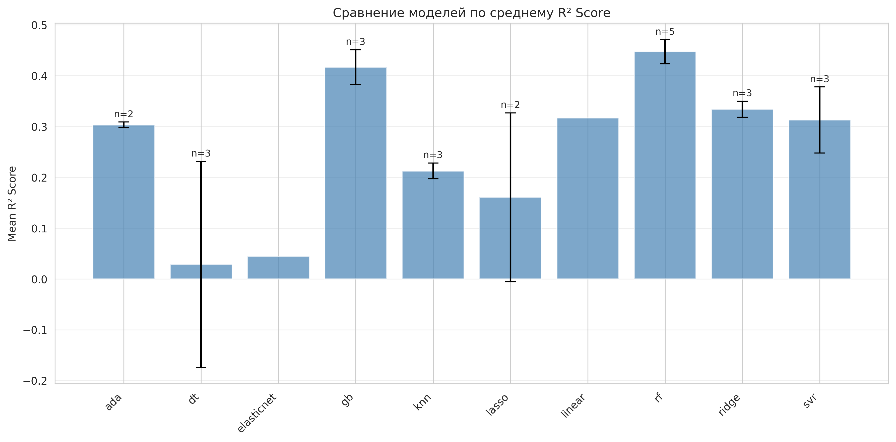

# Отчет об экспериментах

**Дата генерации:** 2025-11-18 21:23:29
**Количество экспериментов:** 26

## Содержание

- [Сводка](#сводка)
- [Сравнительная таблица](#сравнительная-таблица)
- [Визуализации](#визуализации)
- [Детали экспериментов](#детали-экспериментов)

## Сводка

### Статистика по моделям

| Model      |   ('alpha', 'mean') |   ('alpha', 'std') |   ('alpha', 'count') |   ('train_mse', 'mean') |   ('train_mse', 'std') |   ('train_mse', 'count') |   ('train_rmse', 'mean') |   ('train_rmse', 'std') |   ('train_rmse', 'count') |   ('train_mae', 'mean') |   ('train_mae', 'std') |   ('train_mae', 'count') |   ('train_r2', 'mean') |   ('train_r2', 'std') |   ('train_r2', 'count') |   ('test_mse', 'mean') |   ('test_mse', 'std') |   ('test_mse', 'count') |   ('test_rmse', 'mean') |   ('test_rmse', 'std') |   ('test_rmse', 'count') |   ('test_mae', 'mean') |   ('test_mae', 'std') |   ('test_mae', 'count') |   ('test_r2', 'mean') |   ('test_r2', 'std') |   ('test_r2', 'count') |   ('C', 'mean') |   ('C', 'std') |   ('C', 'count') |   ('max_depth', 'mean') |   ('max_depth', 'std') |   ('max_depth', 'count') |   ('n_estimators', 'mean') |   ('n_estimators', 'std') |   ('n_estimators', 'count') |   ('l1_ratio', 'mean') |   ('l1_ratio', 'std') |   ('l1_ratio', 'count') |   ('n_neighbors', 'mean') |   ('n_neighbors', 'std') |   ('n_neighbors', 'count') |
|:-----------|--------------------:|-------------------:|---------------------:|------------------------:|-----------------------:|-------------------------:|-------------------------:|------------------------:|--------------------------:|------------------------:|-----------------------:|-------------------------:|-----------------------:|----------------------:|------------------------:|-----------------------:|----------------------:|------------------------:|------------------------:|-----------------------:|-------------------------:|-----------------------:|----------------------:|------------------------:|----------------------:|---------------------:|-----------------------:|----------------:|---------------:|-----------------:|------------------------:|-----------------------:|-------------------------:|---------------------------:|--------------------------:|----------------------------:|-----------------------:|----------------------:|------------------------:|--------------------------:|-------------------------:|---------------------------:|
| ada        |            nan      |           nan      |               0.0000 |                  0.3227 |                 0.0041 |                   2.0000 |                   0.5680 |                  0.0036 |                    2.0000 |                  0.4685 |                 0.0061 |                   2.0000 |                 0.5198 |                0.0061 |                  2.0000 |                 0.3878 |                0.0032 |                  2.0000 |                  0.6228 |                 0.0025 |                   2.0000 |                 0.4983 |                0.0019 |                  2.0000 |                0.3030 |               0.0057 |                 2.0000 |        nan      |       nan      |           0.0000 |                nan      |               nan      |                   0.0000 |                    75.0000 |                   35.3553 |                      2.0000 |               nan      |                   nan |                  0.0000 |                  nan      |                 nan      |                     0.0000 |
| dt         |            nan      |           nan      |               0.0000 |                  0.1364 |                 0.1691 |                   3.0000 |                   0.2865 |                  0.2853 |                    3.0000 |                  0.1946 |                 0.2195 |                   3.0000 |                 0.7970 |                0.2517 |                  3.0000 |                 0.5406 |                0.1128 |                  3.0000 |                  0.7324 |                 0.0792 |                   3.0000 |                 0.5054 |                0.0101 |                  3.0000 |                0.0286 |               0.2027 |                 3.0000 |        nan      |       nan      |           0.0000 |                 11.6667 |                 7.6376 |                   3.0000 |                   nan      |                  nan      |                      0.0000 |               nan      |                   nan |                  0.0000 |                  nan      |                 nan      |                     0.0000 |
| elasticnet |              1.0000 |           nan      |               1.0000 |                  0.6511 |               nan      |                   1.0000 |                   0.8069 |                nan      |                    1.0000 |                  0.6603 |               nan      |                   1.0000 |                 0.0310 |              nan      |                  1.0000 |                 0.5318 |              nan      |                  1.0000 |                  0.7292 |               nan      |                   1.0000 |                 0.6036 |              nan      |                  1.0000 |                0.0444 |             nan      |                 1.0000 |        nan      |       nan      |           0.0000 |                nan      |               nan      |                   0.0000 |                   nan      |                  nan      |                      0.0000 |                 0.5000 |                   nan |                  1.0000 |                  nan      |                 nan      |                     0.0000 |
| gb         |            nan      |           nan      |               0.0000 |                  0.1842 |                 0.1170 |                   3.0000 |                   0.4097 |                  0.1567 |                    3.0000 |                  0.3210 |                 0.1264 |                   3.0000 |                 0.7259 |                0.1742 |                  3.0000 |                 0.3246 |                0.0191 |                  3.0000 |                  0.5696 |                 0.0168 |                   3.0000 |                 0.4400 |                0.0284 |                  3.0000 |                0.4167 |               0.0342 |                 3.0000 |        nan      |       nan      |           0.0000 |                  3.6667 |                 1.1547 |                   3.0000 |                    83.3333 |                   28.8675 |                      3.0000 |               nan      |                   nan |                  0.0000 |                  nan      |                 nan      |                     0.0000 |
| knn        |            nan      |           nan      |               0.0000 |                  0.4672 |                 0.0658 |                   3.0000 |                   0.6824 |                  0.0487 |                    3.0000 |                  0.5321 |                 0.0446 |                   3.0000 |                 0.3046 |                0.0979 |                  3.0000 |                 0.4382 |                0.0086 |                  3.0000 |                  0.6619 |                 0.0065 |                   3.0000 |                 0.5135 |                0.0102 |                  3.0000 |                0.2125 |               0.0155 |                 3.0000 |        nan      |       nan      |           0.0000 |                nan      |               nan      |                   0.0000 |                   nan      |                  nan      |                      0.0000 |               nan      |                   nan |                  0.0000 |                   11.6667 |                   7.6376 |                     3.0000 |
| lasso      |              0.5500 |             0.6364 |               2.0000 |                  0.5811 |                 0.1000 |                   2.0000 |                   0.7609 |                  0.0657 |                    2.0000 |                  0.6139 |                 0.0704 |                   2.0000 |                 0.1351 |                0.1489 |                  2.0000 |                 0.4671 |                0.0925 |                  2.0000 |                  0.6818 |                 0.0678 |                   2.0000 |                 0.5588 |                0.0696 |                  2.0000 |                0.1606 |               0.1662 |                 2.0000 |        nan      |       nan      |           0.0000 |                nan      |               nan      |                   0.0000 |                   nan      |                  nan      |                      0.0000 |               nan      |                   nan |                  0.0000 |                  nan      |                 nan      |                     0.0000 |
| linear     |            nan      |           nan      |               0.0000 |                  0.4151 |               nan      |                   1.0000 |                   0.6443 |                nan      |                    1.0000 |                  0.5022 |               nan      |                   1.0000 |                 0.3822 |              nan      |                  1.0000 |                 0.3800 |              nan      |                  1.0000 |                  0.6165 |               nan      |                   1.0000 |                 0.4773 |              nan      |                  1.0000 |                0.3171 |             nan      |                 1.0000 |        nan      |       nan      |           0.0000 |                nan      |               nan      |                   0.0000 |                   nan      |                  nan      |                      0.0000 |               nan      |                   nan |                  0.0000 |                  nan      |                 nan      |                     0.0000 |
| rf         |            nan      |           nan      |               0.0000 |                  0.1182 |                 0.0891 |                   5.0000 |                   0.3285 |                  0.1135 |                    5.0000 |                  0.2524 |                 0.0957 |                   5.0000 |                 0.8240 |                0.1326 |                  5.0000 |                 0.3076 |                0.0134 |                  5.0000 |                  0.5545 |                 0.0119 |                   5.0000 |                 0.4268 |                0.0211 |                  5.0000 |                0.4473 |               0.0241 |                 5.0000 |        nan      |       nan      |           0.0000 |                 11.0000 |                 5.4772 |                   5.0000 |                   110.0000 |                   54.7723 |                      5.0000 |               nan      |                   nan |                  0.0000 |                  nan      |                 nan      |                     0.0000 |
| ridge      |              3.7000 |             5.4745 |               3.0000 |                  0.4197 |                 0.0061 |                   3.0000 |                   0.6478 |                  0.0047 |                    3.0000 |                  0.5044 |                 0.0030 |                   3.0000 |                 0.3754 |                0.0091 |                  3.0000 |                 0.3706 |                0.0088 |                  3.0000 |                  0.6087 |                 0.0073 |                   3.0000 |                 0.4701 |                0.0063 |                  3.0000 |                0.3341 |               0.0159 |                 3.0000 |        nan      |       nan      |           0.0000 |                nan      |               nan      |                   0.0000 |                   nan      |                  nan      |                      0.0000 |               nan      |                   nan |                  0.0000 |                  nan      |                 nan      |                     0.0000 |
| svr        |            nan      |           nan      |               0.0000 |                  0.4893 |                 0.0736 |                   3.0000 |                   0.6982 |                  0.0521 |                    3.0000 |                  0.5279 |                 0.0372 |                   3.0000 |                 0.2718 |                0.1095 |                  3.0000 |                 0.3824 |                0.0361 |                  3.0000 |                  0.6179 |                 0.0289 |                   3.0000 |                 0.4652 |                0.0183 |                  3.0000 |                0.3128 |               0.0650 |                 3.0000 |          4.0000 |         5.1962 |           3.0000 |                nan      |               nan      |                   0.0000 |                   nan      |                  nan      |                      0.0000 |               nan      |                   nan |                  0.0000 |                  nan      |                 nan      |                     0.0000 |

### Топ-5 экспериментов по R² Score

| Experiment ID     | Model   |   test_r2 |   test_rmse |
|:------------------|:--------|----------:|------------:|
| exp_021_rf_100_20 | rf      |    0.4625 |      0.5469 |
| exp_018_rf_100_10 | rf      |    0.4599 |      0.5482 |
| exp_017_rf_50_10  | rf      |    0.4554 |      0.5505 |
| exp_026_gb_100_5  | gb      |    0.4546 |      0.5509 |
| exp_019_rf_200_10 | rf      |    0.4540 |      0.5512 |

## Сравнительная таблица

| Experiment ID       | Model      |   test_mse |   test_rmse |   test_mae |   test_r2 |
|:--------------------|:-----------|-----------:|------------:|-----------:|----------:|
| exp_005_lasso_1.0   | lasso      |     0.5325 |      0.7297 |     0.6080 |    0.0431 |
| exp_003_ridge_0.1   | ridge      |     0.3776 |      0.6145 |     0.4752 |    0.3214 |
| exp_011_svr_rbf     | svr        |     0.4233 |      0.6506 |     0.4859 |    0.2394 |
| exp_021_rf_100_20   | rf         |     0.2991 |      0.5469 |     0.4109 |    0.4625 |
| exp_026_gb_100_5    | gb         |     0.3035 |      0.5509 |     0.4092 |    0.4546 |
| exp_004_ridge_10.0  | ridge      |     0.3607 |      0.6005 |     0.4631 |    0.3519 |
| exp_013_svr_linear  | svr        |     0.3694 |      0.6078 |     0.4585 |    0.3362 |
| exp_007_elasticnet  | elasticnet |     0.5318 |      0.7292 |     0.6036 |    0.0444 |
| exp_014_dt_depth5   | dt         |     0.4124 |      0.6422 |     0.4937 |    0.2590 |
| exp_015_dt_depth10  | dt         |     0.5849 |      0.7648 |     0.5116 |   -0.0511 |
| exp_025_gb_100_3    | gb         |     0.3297 |      0.5742 |     0.4458 |    0.4075 |
| exp_016_dt_depth20  | dt         |     0.6245 |      0.7902 |     0.5109 |   -0.1222 |
| exp_019_rf_200_10   | rf         |     0.3039 |      0.5512 |     0.4214 |    0.4540 |
| exp_020_rf_100_5    | rf         |     0.3313 |      0.5756 |     0.4639 |    0.4046 |
| exp_002_ridge_1.0   | ridge      |     0.3734 |      0.6111 |     0.4721 |    0.3290 |
| exp_018_rf_100_10   | rf         |     0.3005 |      0.5482 |     0.4189 |    0.4599 |
| exp_006_lasso_0.1   | lasso      |     0.4017 |      0.6338 |     0.5096 |    0.2782 |
| exp_008_knn_5       | knn        |     0.4330 |      0.6580 |     0.5039 |    0.2219 |
| exp_012_svr_rbf_c10 | svr        |     0.3546 |      0.5955 |     0.4511 |    0.3628 |
| exp_022_ada_50      | ada        |     0.3856 |      0.6210 |     0.4997 |    0.3071 |
| exp_017_rf_50_10    | rf         |     0.3031 |      0.5505 |     0.4191 |    0.4554 |
| exp_010_knn_20      | knn        |     0.4482 |      0.6695 |     0.5242 |    0.1946 |
| exp_001_linear      | linear     |     0.3800 |      0.6165 |     0.4773 |    0.3171 |
| exp_009_knn_10      | knn        |     0.4334 |      0.6583 |     0.5122 |    0.2212 |
| exp_024_gb_50_3     | gb         |     0.3406 |      0.5836 |     0.4650 |    0.3879 |
| exp_023_ada_100     | ada        |     0.3901 |      0.6246 |     0.4970 |    0.2990 |

### Полная таблица

Развернуть полную таблицу

| Experiment ID       | Model      |    alpha |   train_mse |   train_rmse |   train_mae |   train_r2 |   test_mse |   test_rmse |   test_mae |   test_r2 |        C | kernel   |   max_depth |   n_estimators |   l1_ratio |   n_neighbors |
|:--------------------|:-----------|---------:|------------:|-------------:|------------:|-----------:|-----------:|------------:|-----------:|----------:|---------:|:---------|------------:|---------------:|-----------:|--------------:|
| exp_005_lasso_1.0   | lasso      |   1.0000 |      0.6518 |       0.8074 |      0.6637 |     0.0299 |     0.5325 |      0.7297 |     0.6080 |    0.0431 | nan      | nan      |    nan      |       nan      |   nan      |      nan      |
| exp_003_ridge_0.1   | ridge      |   0.1000 |      0.4156 |       0.6447 |      0.5026 |     0.3814 |     0.3776 |      0.6145 |     0.4752 |    0.3214 | nan      | nan      |    nan      |       nan      |   nan      |      nan      |
| exp_011_svr_rbf     | svr        | nan      |      0.5696 |       0.7547 |      0.5687 |     0.1523 |     0.4233 |      0.6506 |     0.4859 |    0.2394 |   1.0000 | rbf      |    nan      |       nan      |   nan      |      nan      |
| exp_021_rf_100_20   | rf         | nan      |      0.0523 |       0.2287 |      0.1646 |     0.9221 |     0.2991 |      0.5469 |     0.4109 |    0.4625 | nan      | nan      |     20.0000 |       100.0000 |   nan      |      nan      |
| exp_026_gb_100_5    | gb         | nan      |      0.0540 |       0.2324 |      0.1777 |     0.9196 |     0.3035 |      0.5509 |     0.4092 |    0.4546 | nan      | nan      |      5.0000 |       100.0000 |   nan      |      nan      |
| exp_004_ridge_10.0  | ridge      |  10.0000 |      0.4267 |       0.6532 |      0.5079 |     0.3650 |     0.3607 |      0.6005 |     0.4631 |    0.3519 | nan      | nan      |    nan      |       nan      |   nan      |      nan      |
| exp_013_svr_linear  | svr        | nan      |      0.4252 |       0.6521 |      0.4959 |     0.3672 |     0.3694 |      0.6078 |     0.4585 |    0.3362 |   1.0000 | linear   |    nan      |       nan      |   nan      |      nan      |
| exp_007_elasticnet  | elasticnet |   1.0000 |      0.6511 |       0.8069 |      0.6603 |     0.0310 |     0.5318 |      0.7292 |     0.6036 |    0.0444 | nan      | nan      |    nan      |       nan      |     0.5000 |      nan      |
| exp_014_dt_depth5   | dt         | nan      |      0.3256 |       0.5706 |      0.4325 |     0.5154 |     0.4124 |      0.6422 |     0.4937 |    0.2590 | nan      | nan      |      5.0000 |       nan      |   nan      |      nan      |
| exp_015_dt_depth10  | dt         | nan      |      0.0835 |       0.2890 |      0.1514 |     0.8757 |     0.5849 |      0.7648 |     0.5116 |   -0.0511 | nan      | nan      |     10.0000 |       nan      |   nan      |      nan      |
| exp_025_gb_100_3    | gb         | nan      |      0.2179 |       0.4668 |      0.3682 |     0.6757 |     0.3297 |      0.5742 |     0.4458 |    0.4075 | nan      | nan      |      3.0000 |       100.0000 |   nan      |      nan      |
| exp_016_dt_depth20  | dt         | nan      |      0.0000 |       0.0000 |      0.0000 |     1.0000 |     0.6245 |      0.7902 |     0.5109 |   -0.1222 | nan      | nan      |     20.0000 |       nan      |   nan      |      nan      |
| exp_019_rf_200_10   | rf         | nan      |      0.0877 |       0.2962 |      0.2262 |     0.8695 |     0.3039 |      0.5512 |     0.4214 |    0.4540 | nan      | nan      |     10.0000 |       200.0000 |   nan      |      nan      |
| exp_020_rf_100_5    | rf         | nan      |      0.2752 |       0.5246 |      0.4166 |     0.5904 |     0.3313 |      0.5756 |     0.4639 |    0.4046 | nan      | nan      |      5.0000 |       100.0000 |   nan      |      nan      |
| exp_002_ridge_1.0   | ridge      |   1.0000 |      0.4167 |       0.6455 |      0.5027 |     0.3799 |     0.3734 |      0.6111 |     0.4721 |    0.3290 | nan      | nan      |    nan      |       nan      |   nan      |      nan      |
| exp_018_rf_100_10   | rf         | nan      |      0.0881 |       0.2968 |      0.2269 |     0.8689 |     0.3005 |      0.5482 |     0.4189 |    0.4599 | nan      | nan      |     10.0000 |       100.0000 |   nan      |      nan      |
| exp_006_lasso_0.1   | lasso      |   0.1000 |      0.5104 |       0.7144 |      0.5641 |     0.2404 |     0.4017 |      0.6338 |     0.5096 |    0.2782 | nan      | nan      |    nan      |       nan      |   nan      |      nan      |
| exp_008_knn_5       | knn        | nan      |      0.3965 |       0.6296 |      0.4834 |     0.4100 |     0.4330 |      0.6580 |     0.5039 |    0.2219 | nan      | nan      |    nan      |       nan      |   nan      |        5.0000 |
| exp_012_svr_rbf_c10 | svr        | nan      |      0.4730 |       0.6878 |      0.5192 |     0.2960 |     0.3546 |      0.5955 |     0.4511 |    0.3628 |  10.0000 | rbf      |    nan      |       nan      |   nan      |      nan      |
| exp_022_ada_50      | ada        | nan      |      0.3256 |       0.5706 |      0.4728 |     0.5155 |     0.3856 |      0.6210 |     0.4997 |    0.3071 | nan      | nan      |    nan      |        50.0000 |   nan      |      nan      |
| exp_017_rf_50_10    | rf         | nan      |      0.0878 |       0.2963 |      0.2274 |     0.8694 |     0.3031 |      0.5505 |     0.4191 |    0.4554 | nan      | nan      |     10.0000 |        50.0000 |   nan      |      nan      |
| exp_010_knn_20      | knn        | nan      |      0.5265 |       0.7256 |      0.5708 |     0.2165 |     0.4482 |      0.6695 |     0.5242 |    0.1946 | nan      | nan      |    nan      |       nan      |   nan      |       20.0000 |
| exp_001_linear      | linear     | nan      |      0.4151 |       0.6443 |      0.5022 |     0.3822 |     0.3800 |      0.6165 |     0.4773 |    0.3171 | nan      | nan      |    nan      |       nan      |   nan      |      nan      |
| exp_009_knn_10      | knn        | nan      |      0.4787 |       0.6919 |      0.5421 |     0.2875 |     0.4334 |      0.6583 |     0.5122 |    0.2212 | nan      | nan      |    nan      |       nan      |   nan      |       10.0000 |
| exp_024_gb_50_3     | gb         | nan      |      0.2807 |       0.5298 |      0.4171 |     0.5823 |     0.3406 |      0.5836 |     0.4650 |    0.3879 | nan      | nan      |      3.0000 |        50.0000 |   nan      |      nan      |
| exp_023_ada_100     | ada        | nan      |      0.3198 |       0.5655 |      0.4642 |     0.5241 |     0.3901 |      0.6246 |     0.4970 |    0.2990 | nan      | nan      |    nan      |       100.0000 |   nan      |      nan      |

## Визуализации

### Сравнение метрик

### Сравнение моделей

## Детали экспериментов

### exp_005_lasso_1.0

**Модель:** lasso

**Параметры:**
- `alpha`: 1.0

**Метрики:**
- `train_mse`: 0.6518
- `train_rmse`: 0.8074
- `train_mae`: 0.6637
- `train_r2`: 0.0299
- `test_mse`: 0.5325
- `test_rmse`: 0.7297
- `test_mae`: 0.6080
- `test_r2`: 0.0431

### exp_003_ridge_0.1

**Модель:** ridge

**Параметры:**
- `alpha`: 0.1

**Метрики:**
- `train_mse`: 0.4156
- `train_rmse`: 0.6447
- `train_mae`: 0.5026
- `train_r2`: 0.3814
- `test_mse`: 0.3776
- `test_rmse`: 0.6145
- `test_mae`: 0.4752
- `test_r2`: 0.3214

### exp_011_svr_rbf

**Модель:** svr

**Параметры:**
- `C`: 1.0
- `kernel`: rbf

**Метрики:**
- `train_mse`: 0.5696
- `train_rmse`: 0.7547
- `train_mae`: 0.5687
- `train_r2`: 0.1523
- `test_mse`: 0.4233
- `test_rmse`: 0.6506
- `test_mae`: 0.4859
- `test_r2`: 0.2394

### exp_021_rf_100_20

**Модель:** rf

**Параметры:**
- `max_depth`: 20
- `n_estimators`: 100

**Метрики:**
- `train_mse`: 0.0523
- `train_rmse`: 0.2287
- `train_mae`: 0.1646
- `train_r2`: 0.9221
- `test_mse`: 0.2991
- `test_rmse`: 0.5469
- `test_mae`: 0.4109
- `test_r2`: 0.4625

### exp_026_gb_100_5

**Модель:** gb

**Параметры:**
- `max_depth`: 5
- `n_estimators`: 100

**Метрики:**
- `train_mse`: 0.0540
- `train_rmse`: 0.2324
- `train_mae`: 0.1777
- `train_r2`: 0.9196
- `test_mse`: 0.3035
- `test_rmse`: 0.5509
- `test_mae`: 0.4092
- `test_r2`: 0.4546

### exp_004_ridge_10.0

**Модель:** ridge

**Параметры:**
- `alpha`: 10.0

**Метрики:**
- `train_mse`: 0.4267
- `train_rmse`: 0.6532
- `train_mae`: 0.5079
- `train_r2`: 0.3650
- `test_mse`: 0.3607
- `test_rmse`: 0.6005
- `test_mae`: 0.4631
- `test_r2`: 0.3519

### exp_013_svr_linear

**Модель:** svr

**Параметры:**
- `C`: 1.0
- `kernel`: linear

**Метрики:**
- `train_mse`: 0.4252
- `train_rmse`: 0.6521
- `train_mae`: 0.4959
- `train_r2`: 0.3672
- `test_mse`: 0.3694
- `test_rmse`: 0.6078
- `test_mae`: 0.4585
- `test_r2`: 0.3362

### exp_007_elasticnet

**Модель:** elasticnet

**Параметры:**
- `alpha`: 1.0
- `l1_ratio`: 0.5

**Метрики:**
- `train_mse`: 0.6511
- `train_rmse`: 0.8069
- `train_mae`: 0.6603
- `train_r2`: 0.0310
- `test_mse`: 0.5318
- `test_rmse`: 0.7292
- `test_mae`: 0.6036
- `test_r2`: 0.0444

### exp_014_dt_depth5

**Модель:** dt

**Параметры:**
- `max_depth`: 5

**Метрики:**
- `train_mse`: 0.3256
- `train_rmse`: 0.5706
- `train_mae`: 0.4325
- `train_r2`: 0.5154
- `test_mse`: 0.4124
- `test_rmse`: 0.6422
- `test_mae`: 0.4937
- `test_r2`: 0.2590

### exp_015_dt_depth10

**Модель:** dt

**Параметры:**
- `max_depth`: 10

**Метрики:**
- `train_mse`: 0.0835
- `train_rmse`: 0.2890
- `train_mae`: 0.1514
- `train_r2`: 0.8757
- `test_mse`: 0.5849
- `test_rmse`: 0.7648
- `test_mae`: 0.5116
- `test_r2`: -0.0511

### exp_025_gb_100_3

**Модель:** gb

**Параметры:**
- `max_depth`: 3
- `n_estimators`: 100

**Метрики:**
- `train_mse`: 0.2179
- `train_rmse`: 0.4668
- `train_mae`: 0.3682
- `train_r2`: 0.6757
- `test_mse`: 0.3297
- `test_rmse`: 0.5742
- `test_mae`: 0.4458
- `test_r2`: 0.4075

### exp_016_dt_depth20

**Модель:** dt

**Параметры:**
- `max_depth`: 20

**Метрики:**
- `train_mse`: 0.0000
- `train_rmse`: 0.0000
- `train_mae`: 0.0000
- `train_r2`: 1.0000
- `test_mse`: 0.6245
- `test_rmse`: 0.7902
- `test_mae`: 0.5109
- `test_r2`: -0.1222

### exp_019_rf_200_10

**Модель:** rf

**Параметры:**
- `max_depth`: 10
- `n_estimators`: 200

**Метрики:**
- `train_mse`: 0.0877
- `train_rmse`: 0.2962
- `train_mae`: 0.2262
- `train_r2`: 0.8695
- `test_mse`: 0.3039
- `test_rmse`: 0.5512
- `test_mae`: 0.4214
- `test_r2`: 0.4540

### exp_020_rf_100_5

**Модель:** rf

**Параметры:**
- `max_depth`: 5
- `n_estimators`: 100

**Метрики:**
- `train_mse`: 0.2752
- `train_rmse`: 0.5246
- `train_mae`: 0.4166
- `train_r2`: 0.5904
- `test_mse`: 0.3313
- `test_rmse`: 0.5756
- `test_mae`: 0.4639
- `test_r2`: 0.4046

### exp_002_ridge_1.0

**Модель:** ridge

**Параметры:**
- `alpha`: 1.0

**Метрики:**
- `train_mse`: 0.4167
- `train_rmse`: 0.6455
- `train_mae`: 0.5027
- `train_r2`: 0.3799
- `test_mse`: 0.3734
- `test_rmse`: 0.6111
- `test_mae`: 0.4721
- `test_r2`: 0.3290

### exp_018_rf_100_10

**Модель:** rf

**Параметры:**
- `max_depth`: 10
- `n_estimators`: 100

**Метрики:**
- `train_mse`: 0.0881
- `train_rmse`: 0.2968
- `train_mae`: 0.2269
- `train_r2`: 0.8689
- `test_mse`: 0.3005
- `test_rmse`: 0.5482
- `test_mae`: 0.4189
- `test_r2`: 0.4599

### exp_006_lasso_0.1

**Модель:** lasso

**Параметры:**
- `alpha`: 0.1

**Метрики:**
- `train_mse`: 0.5104
- `train_rmse`: 0.7144
- `train_mae`: 0.5641
- `train_r2`: 0.2404
- `test_mse`: 0.4017
- `test_rmse`: 0.6338
- `test_mae`: 0.5096
- `test_r2`: 0.2782

### exp_008_knn_5

**Модель:** knn

**Параметры:**
- `n_neighbors`: 5

**Метрики:**
- `train_mse`: 0.3965
- `train_rmse`: 0.6296
- `train_mae`: 0.4834
- `train_r2`: 0.4100
- `test_mse`: 0.4330
- `test_rmse`: 0.6580
- `test_mae`: 0.5039
- `test_r2`: 0.2219

### exp_012_svr_rbf_c10

**Модель:** svr

**Параметры:**
- `C`: 10.0
- `kernel`: rbf

**Метрики:**
- `train_mse`: 0.4730
- `train_rmse`: 0.6878
- `train_mae`: 0.5192
- `train_r2`: 0.2960
- `test_mse`: 0.3546
- `test_rmse`: 0.5955
- `test_mae`: 0.4511
- `test_r2`: 0.3628

### exp_022_ada_50

**Модель:** ada

**Параметры:**
- `n_estimators`: 50

**Метрики:**
- `train_mse`: 0.3256
- `train_rmse`: 0.5706
- `train_mae`: 0.4728
- `train_r2`: 0.5155
- `test_mse`: 0.3856
- `test_rmse`: 0.6210
- `test_mae`: 0.4997
- `test_r2`: 0.3071

### exp_017_rf_50_10

**Модель:** rf

**Параметры:**
- `max_depth`: 10
- `n_estimators`: 50

**Метрики:**
- `train_mse`: 0.0878
- `train_rmse`: 0.2963
- `train_mae`: 0.2274
- `train_r2`: 0.8694
- `test_mse`: 0.3031
- `test_rmse`: 0.5505
- `test_mae`: 0.4191
- `test_r2`: 0.4554

### exp_010_knn_20

**Модель:** knn

**Параметры:**
- `n_neighbors`: 20

**Метрики:**
- `train_mse`: 0.5265
- `train_rmse`: 0.7256
- `train_mae`: 0.5708
- `train_r2`: 0.2165
- `test_mse`: 0.4482
- `test_rmse`: 0.6695
- `test_mae`: 0.5242
- `test_r2`: 0.1946

### exp_001_linear

**Модель:** linear

**Параметры:**

**Метрики:**
- `train_mse`: 0.4151
- `train_rmse`: 0.6443
- `train_mae`: 0.5022
- `train_r2`: 0.3822
- `test_mse`: 0.3800
- `test_rmse`: 0.6165
- `test_mae`: 0.4773
- `test_r2`: 0.3171

### exp_009_knn_10

**Модель:** knn

**Параметры:**
- `n_neighbors`: 10

**Метрики:**
- `train_mse`: 0.4787
- `train_rmse`: 0.6919
- `train_mae`: 0.5421
- `train_r2`: 0.2875
- `test_mse`: 0.4334
- `test_rmse`: 0.6583
- `test_mae`: 0.5122
- `test_r2`: 0.2212

### exp_024_gb_50_3

**Модель:** gb

**Параметры:**
- `max_depth`: 3
- `n_estimators`: 50

**Метрики:**
- `train_mse`: 0.2807
- `train_rmse`: 0.5298
- `train_mae`: 0.4171
- `train_r2`: 0.5823
- `test_mse`: 0.3406
- `test_rmse`: 0.5836
- `test_mae`: 0.4650
- `test_r2`: 0.3879

### exp_023_ada_100

**Модель:** ada

**Параметры:**
- `n_estimators`: 100

**Метрики:**
- `train_mse`: 0.3198
- `train_rmse`: 0.5655
- `train_mae`: 0.4642
- `train_r2`: 0.5241
- `test_mse`: 0.3901
- `test_rmse`: 0.6246
- `test_mae`: 0.4970
- `test_r2`: 0.2990
